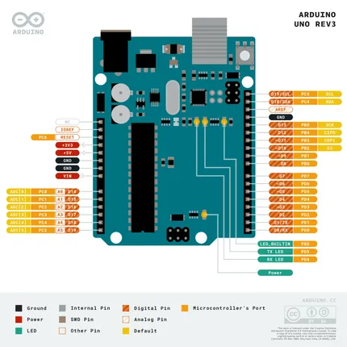

# UNO Rev3 with Long Pins

**Arduino** · Other

Revision: Not identified  
Coverage: Pinout image collected

[Browse all manufacturers](../../../../BROWSE.md) · [Desktop app](https://github.com/valleytechsolutions/black-wire-desktop)

## Pinout-UNOrev3_latest

**pinout image** · Reviewed source · PNG

[Open original reference](../../../../library/media/80dab00a5ee12c3a1fdf23171e55cc9bd094e954e595e19ec772d89de62cadb2.png)

**Credit and rights:** Not established; source attribution retained. Source/manufacturer: Arduino.

[Source 1](https://raw.githubusercontent.com/arduino/docs-content/dab66ecbd6ad52cd742da6c19c5b6330a7f2caae/content/retired/01.boards/arduino-uno-rev3-with-long-pins/assets/Pinout-UNOrev3_latest.png) · [Source 2](https://docs.arduino.cc/retired/boards/arduino-uno-rev3-with-long-pins/) · [Source 3](https://github.com/arduino/docs-content/blob/dab66ecbd6ad52cd742da6c19c5b6330a7f2caae/content/retired/01.boards/arduino-uno-rev3-with-long-pins/content.md) · [Source 4](https://github.com/arduino/docs-content/blob/dab66ecbd6ad52cd742da6c19c5b6330a7f2caae/content/retired/01.boards/arduino-uno-rev3-with-long-pins/assets/Pinout-UNOrev3_latest.png)

Official Arduino documentation repository pinned at dab66ecbd6ad52cd742da6c19c5b6330a7f2caae. Match the board model, SKU and revision printed on each source sheet; lifecycle is not inferred from repository folder placement.

SHA-256: `80dab00a5ee12c3a1fdf23171e55cc9bd094e954e595e19ec772d89de62cadb2`

Pin assignments have not been independently electrically verified. Check board revision before wiring.
