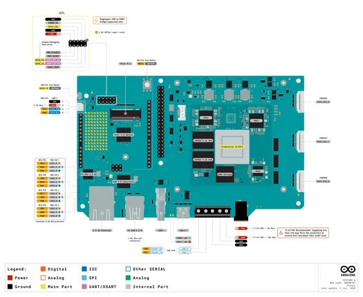
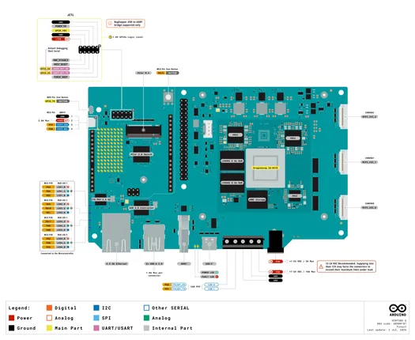
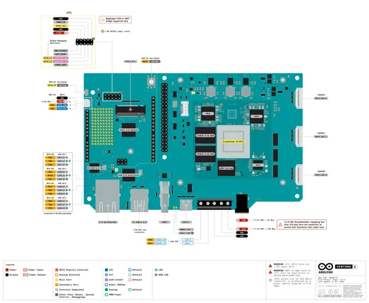
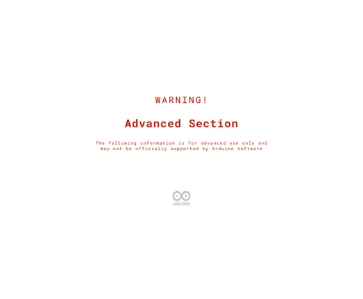
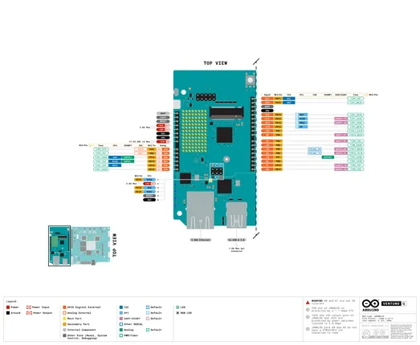
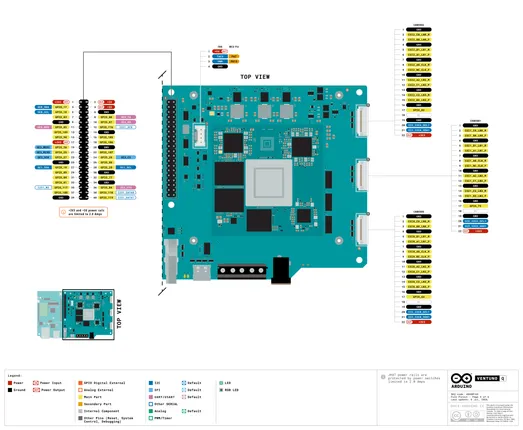
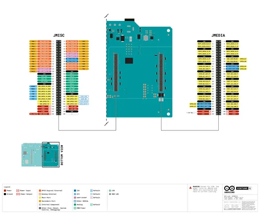
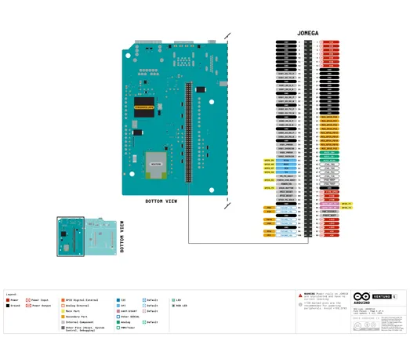

# VENTUNO Q

**Arduino** · Other

Revision: Not identified  
Coverage: Pinout image collected

[Browse all manufacturers](../../../../BROWSE.md) · [Desktop app](https://github.com/valleytechsolutions/black-wire-desktop)

## ABX00181_pinout

**pinout image** · Reviewed source · PNG

[Open original reference](../../../../library/media/55b04aaa141f3ad8f8030ba2f004d71fcbcfe6b5a89ea80638fb21267e4da671.png)

**Credit and rights:** Not established; source attribution retained. Source/manufacturer: Arduino.

[Source 1](https://raw.githubusercontent.com/arduino/docs-content/dab66ecbd6ad52cd742da6c19c5b6330a7f2caae/content/hardware/ventuno/boards/ventuno-q/datasheet/assets/ABX00181_pinout.png) · [Source 2](https://docs.arduino.cc/hardware/ventuno-q/) · [Source 3](https://github.com/arduino/docs-content/blob/dab66ecbd6ad52cd742da6c19c5b6330a7f2caae/content/hardware/ventuno/boards/ventuno-q/product.md) · [Source 4](https://github.com/arduino/docs-content/blob/dab66ecbd6ad52cd742da6c19c5b6330a7f2caae/content/hardware/ventuno/boards/ventuno-q/datasheet/assets/ABX00181_pinout.png)

Official Arduino documentation repository pinned at dab66ecbd6ad52cd742da6c19c5b6330a7f2caae. Match the board model, SKU and revision printed on each source sheet; lifecycle is not inferred from repository folder placement.

SHA-256: `55b04aaa141f3ad8f8030ba2f004d71fcbcfe6b5a89ea80638fb21267e4da671`

## ABX00181_pinout

**pinout image** · Reviewed source · PNG

[Open original reference](../../../../library/media/4f4dbe49fe5c94a3f32ed07e8f8e689b4657c7d30335ffda28f1593f2db73282.png)

**Credit and rights:** Not established; source attribution retained. Source/manufacturer: Arduino.

[Source 1](https://raw.githubusercontent.com/arduino/docs-content/dab66ecbd6ad52cd742da6c19c5b6330a7f2caae/content/hardware/ventuno/boards/ventuno-q/tutorials/first-steps/user-manual/assets/ABX00181_pinout.png) · [Source 2](https://docs.arduino.cc/hardware/ventuno-q/) · [Source 3](https://github.com/arduino/docs-content/blob/dab66ecbd6ad52cd742da6c19c5b6330a7f2caae/content/hardware/ventuno/boards/ventuno-q/product.md) · [Source 4](https://github.com/arduino/docs-content/blob/dab66ecbd6ad52cd742da6c19c5b6330a7f2caae/content/hardware/ventuno/boards/ventuno-q/tutorials/first-steps/user-manual/assets/ABX00181_pinout.png)

Official Arduino documentation repository pinned at dab66ecbd6ad52cd742da6c19c5b6330a7f2caae. Match the board model, SKU and revision printed on each source sheet; lifecycle is not inferred from repository folder placement.

SHA-256: `4f4dbe49fe5c94a3f32ed07e8f8e689b4657c7d30335ffda28f1593f2db73282`

## Official full pinout - page 1

**pinout image** · Reviewed source · PNG

[Open original reference](../../../../library/media/85b4c4530ee53f83cae06cef2af7883964d7e61a67d65e426c99253612a64f13.png)

**Credit and rights:** Not established; source attribution retained. Source/manufacturer: Arduino.

[Source 1](https://raw.githubusercontent.com/arduino/docs-content/dab66ecbd6ad52cd742da6c19c5b6330a7f2caae/content/hardware/ventuno/boards/ventuno-q/downloads/ABX00181-full-pinout.pdf) · [Source 2](https://docs.arduino.cc/hardware/ventuno-q/) · [Source 3](https://github.com/arduino/docs-content/blob/dab66ecbd6ad52cd742da6c19c5b6330a7f2caae/content/hardware/ventuno/boards/ventuno-q/product.md) · [Source 4](https://github.com/arduino/docs-content/blob/dab66ecbd6ad52cd742da6c19c5b6330a7f2caae/content/hardware/ventuno/boards/ventuno-q/downloads/ABX00181-full-pinout.pdf)

Official Arduino documentation repository pinned at dab66ecbd6ad52cd742da6c19c5b6330a7f2caae. Match the board model, SKU and revision printed on each source sheet; lifecycle is not inferred from repository folder placement. Original PDF page 1 rendered at 220 dpi; no labels changed.

SHA-256: `85b4c4530ee53f83cae06cef2af7883964d7e61a67d65e426c99253612a64f13`

## Official full pinout - page 2

**pinout image** · Reviewed source · PNG

[Open original reference](../../../../library/media/b771fa4cf050a995a72d2eba2849e0452fc6203708d6b02968ce2311d975e4ec.png)

**Credit and rights:** Not established; source attribution retained. Source/manufacturer: Arduino.

[Source 1](https://raw.githubusercontent.com/arduino/docs-content/dab66ecbd6ad52cd742da6c19c5b6330a7f2caae/content/hardware/ventuno/boards/ventuno-q/downloads/ABX00181-full-pinout.pdf) · [Source 2](https://docs.arduino.cc/hardware/ventuno-q/) · [Source 3](https://github.com/arduino/docs-content/blob/dab66ecbd6ad52cd742da6c19c5b6330a7f2caae/content/hardware/ventuno/boards/ventuno-q/product.md) · [Source 4](https://github.com/arduino/docs-content/blob/dab66ecbd6ad52cd742da6c19c5b6330a7f2caae/content/hardware/ventuno/boards/ventuno-q/downloads/ABX00181-full-pinout.pdf)

Official Arduino documentation repository pinned at dab66ecbd6ad52cd742da6c19c5b6330a7f2caae. Match the board model, SKU and revision printed on each source sheet; lifecycle is not inferred from repository folder placement. Original PDF page 2 rendered at 220 dpi; no labels changed.

SHA-256: `b771fa4cf050a995a72d2eba2849e0452fc6203708d6b02968ce2311d975e4ec`

## Official full pinout - page 3

**pinout image** · Reviewed source · PNG

[Open original reference](../../../../library/media/d07852a5c28d53c70456801b1c01bdb6c8906c354f1f056553247e640781f6dd.png)

**Credit and rights:** Not established; source attribution retained. Source/manufacturer: Arduino.

[Source 1](https://raw.githubusercontent.com/arduino/docs-content/dab66ecbd6ad52cd742da6c19c5b6330a7f2caae/content/hardware/ventuno/boards/ventuno-q/downloads/ABX00181-full-pinout.pdf) · [Source 2](https://docs.arduino.cc/hardware/ventuno-q/) · [Source 3](https://github.com/arduino/docs-content/blob/dab66ecbd6ad52cd742da6c19c5b6330a7f2caae/content/hardware/ventuno/boards/ventuno-q/product.md) · [Source 4](https://github.com/arduino/docs-content/blob/dab66ecbd6ad52cd742da6c19c5b6330a7f2caae/content/hardware/ventuno/boards/ventuno-q/downloads/ABX00181-full-pinout.pdf)

Official Arduino documentation repository pinned at dab66ecbd6ad52cd742da6c19c5b6330a7f2caae. Match the board model, SKU and revision printed on each source sheet; lifecycle is not inferred from repository folder placement. Original PDF page 3 rendered at 220 dpi; no labels changed.

SHA-256: `d07852a5c28d53c70456801b1c01bdb6c8906c354f1f056553247e640781f6dd`

## Official full pinout - page 4

**pinout image** · Reviewed source · PNG

[Open original reference](../../../../library/media/f90ef2a213f4f4d5c05252088bb4f9e9fabf8dc65216cbd2c901be56f2de6c64.png)

**Credit and rights:** Not established; source attribution retained. Source/manufacturer: Arduino.

[Source 1](https://raw.githubusercontent.com/arduino/docs-content/dab66ecbd6ad52cd742da6c19c5b6330a7f2caae/content/hardware/ventuno/boards/ventuno-q/downloads/ABX00181-full-pinout.pdf) · [Source 2](https://docs.arduino.cc/hardware/ventuno-q/) · [Source 3](https://github.com/arduino/docs-content/blob/dab66ecbd6ad52cd742da6c19c5b6330a7f2caae/content/hardware/ventuno/boards/ventuno-q/product.md) · [Source 4](https://github.com/arduino/docs-content/blob/dab66ecbd6ad52cd742da6c19c5b6330a7f2caae/content/hardware/ventuno/boards/ventuno-q/downloads/ABX00181-full-pinout.pdf)

Official Arduino documentation repository pinned at dab66ecbd6ad52cd742da6c19c5b6330a7f2caae. Match the board model, SKU and revision printed on each source sheet; lifecycle is not inferred from repository folder placement. Original PDF page 4 rendered at 220 dpi; no labels changed.

SHA-256: `f90ef2a213f4f4d5c05252088bb4f9e9fabf8dc65216cbd2c901be56f2de6c64`

## Official full pinout - page 5

**pinout image** · Reviewed source · PNG

[Open original reference](../../../../library/media/a828ffe098a59c76d3035138e852d50f58aed2c4c35397e25f9f1e835dc988d9.png)

**Credit and rights:** Not established; source attribution retained. Source/manufacturer: Arduino.

[Source 1](https://raw.githubusercontent.com/arduino/docs-content/dab66ecbd6ad52cd742da6c19c5b6330a7f2caae/content/hardware/ventuno/boards/ventuno-q/downloads/ABX00181-full-pinout.pdf) · [Source 2](https://docs.arduino.cc/hardware/ventuno-q/) · [Source 3](https://github.com/arduino/docs-content/blob/dab66ecbd6ad52cd742da6c19c5b6330a7f2caae/content/hardware/ventuno/boards/ventuno-q/product.md) · [Source 4](https://github.com/arduino/docs-content/blob/dab66ecbd6ad52cd742da6c19c5b6330a7f2caae/content/hardware/ventuno/boards/ventuno-q/downloads/ABX00181-full-pinout.pdf)

Official Arduino documentation repository pinned at dab66ecbd6ad52cd742da6c19c5b6330a7f2caae. Match the board model, SKU and revision printed on each source sheet; lifecycle is not inferred from repository folder placement. Original PDF page 5 rendered at 220 dpi; no labels changed.

SHA-256: `a828ffe098a59c76d3035138e852d50f58aed2c4c35397e25f9f1e835dc988d9`

## Official full pinout - page 6

**pinout image** · Reviewed source · PNG

[Open original reference](../../../../library/media/6bf23d3c7ecd36076bc86eb2e73c4329a6ef7b82d5b67d8f4a9daf5407b2ae25.png)

**Credit and rights:** Not established; source attribution retained. Source/manufacturer: Arduino.

[Source 1](https://raw.githubusercontent.com/arduino/docs-content/dab66ecbd6ad52cd742da6c19c5b6330a7f2caae/content/hardware/ventuno/boards/ventuno-q/downloads/ABX00181-full-pinout.pdf) · [Source 2](https://docs.arduino.cc/hardware/ventuno-q/) · [Source 3](https://github.com/arduino/docs-content/blob/dab66ecbd6ad52cd742da6c19c5b6330a7f2caae/content/hardware/ventuno/boards/ventuno-q/product.md) · [Source 4](https://github.com/arduino/docs-content/blob/dab66ecbd6ad52cd742da6c19c5b6330a7f2caae/content/hardware/ventuno/boards/ventuno-q/downloads/ABX00181-full-pinout.pdf)

Official Arduino documentation repository pinned at dab66ecbd6ad52cd742da6c19c5b6330a7f2caae. Match the board model, SKU and revision printed on each source sheet; lifecycle is not inferred from repository folder placement. Original PDF page 6 rendered at 220 dpi; no labels changed.

SHA-256: `6bf23d3c7ecd36076bc86eb2e73c4329a6ef7b82d5b67d8f4a9daf5407b2ae25`

## Full board pinout PDF

**original reference PDF** · Reviewed source · PDF

[Open original reference](../../../../library/media/3e9abc1ffb8fc5eac9165cb4b59944607ac4a3df7b741440d2322d3351d6daba.pdf)

**Credit and rights:** Not established; source attribution retained. Source/manufacturer: Arduino.

[Source 1](https://raw.githubusercontent.com/arduino/docs-content/dab66ecbd6ad52cd742da6c19c5b6330a7f2caae/content/hardware/ventuno/boards/ventuno-q/downloads/ABX00181-full-pinout.pdf) · [Source 2](https://docs.arduino.cc/hardware/ventuno-q/) · [Source 3](https://github.com/arduino/docs-content/blob/dab66ecbd6ad52cd742da6c19c5b6330a7f2caae/content/hardware/ventuno/boards/ventuno-q/product.md) · [Source 4](https://github.com/arduino/docs-content/blob/dab66ecbd6ad52cd742da6c19c5b6330a7f2caae/content/hardware/ventuno/boards/ventuno-q/downloads/ABX00181-full-pinout.pdf)

Official Arduino documentation repository pinned at dab66ecbd6ad52cd742da6c19c5b6330a7f2caae. Match the board model, SKU and revision printed on each source sheet; lifecycle is not inferred from repository folder placement.

SHA-256: `3e9abc1ffb8fc5eac9165cb4b59944607ac4a3df7b741440d2322d3351d6daba`

Pin assignments have not been independently electrically verified. Check board revision before wiring.
