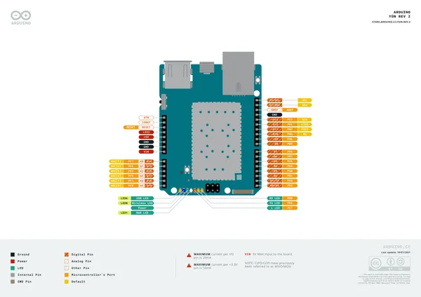
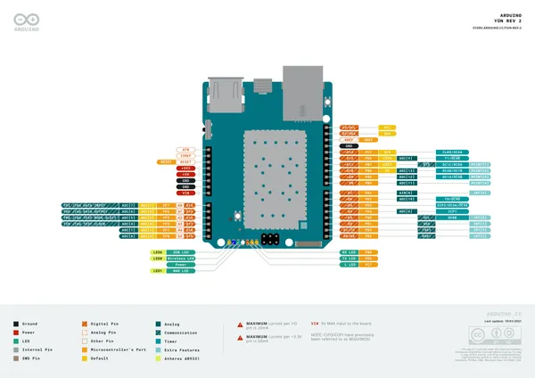
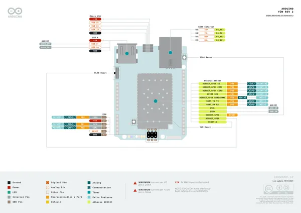
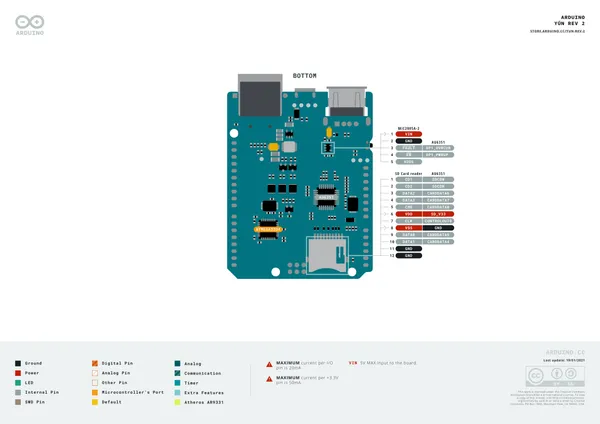

# Yún Rev2

**Arduino** · Other

Revision: Not identified  
Coverage: Pinout image collected

[Browse all manufacturers](../../../../BROWSE.md) · [Desktop app](https://github.com/valleytechsolutions/black-wire-desktop)

## Official full pinout - page 1

**pinout image** · Reviewed source · PNG

[Open original reference](../../../../library/media/57271244957228d3772767abeff988ce6e6e9263f6c9d075994895c2103fd40b.png)

**Credit and rights:** CC BY-SA 4.0 notice printed in the original PDF; preserve attribution and verify scope for publication.. Source/manufacturer: Arduino.

[Source 1](https://raw.githubusercontent.com/arduino/docs-content/dab66ecbd6ad52cd742da6c19c5b6330a7f2caae/content/hardware/hero/boards/yun-rev2/downloads/ABX00020-full-pinout.pdf) · [Source 2](https://docs.arduino.cc/hardware/yun-rev2/) · [Source 3](https://github.com/arduino/docs-content/blob/dab66ecbd6ad52cd742da6c19c5b6330a7f2caae/content/hardware/hero/boards/yun-rev2/product.md) · [Source 4](https://github.com/arduino/docs-content/blob/dab66ecbd6ad52cd742da6c19c5b6330a7f2caae/content/hardware/hero/boards/yun-rev2/downloads/ABX00020-full-pinout.pdf)

Official Arduino documentation repository pinned at dab66ecbd6ad52cd742da6c19c5b6330a7f2caae. Match the board model, SKU and revision printed on each source sheet; lifecycle is not inferred from repository folder placement. Original PDF page 1 rendered at 220 dpi; no labels changed.

SHA-256: `57271244957228d3772767abeff988ce6e6e9263f6c9d075994895c2103fd40b`

## Official full pinout - page 2

**pinout image** · Reviewed source · PNG

[Open original reference](../../../../library/media/e97bd2624c1a89b701026b8f0845314a7805d045f41bc1135ef5568543773e9a.png)

**Credit and rights:** CC BY-SA 4.0 notice printed in the original PDF; preserve attribution and verify scope for publication.. Source/manufacturer: Arduino.

[Source 1](https://raw.githubusercontent.com/arduino/docs-content/dab66ecbd6ad52cd742da6c19c5b6330a7f2caae/content/hardware/hero/boards/yun-rev2/downloads/ABX00020-full-pinout.pdf) · [Source 2](https://docs.arduino.cc/hardware/yun-rev2/) · [Source 3](https://github.com/arduino/docs-content/blob/dab66ecbd6ad52cd742da6c19c5b6330a7f2caae/content/hardware/hero/boards/yun-rev2/product.md) · [Source 4](https://github.com/arduino/docs-content/blob/dab66ecbd6ad52cd742da6c19c5b6330a7f2caae/content/hardware/hero/boards/yun-rev2/downloads/ABX00020-full-pinout.pdf)

Official Arduino documentation repository pinned at dab66ecbd6ad52cd742da6c19c5b6330a7f2caae. Match the board model, SKU and revision printed on each source sheet; lifecycle is not inferred from repository folder placement. Original PDF page 2 rendered at 220 dpi; no labels changed.

SHA-256: `e97bd2624c1a89b701026b8f0845314a7805d045f41bc1135ef5568543773e9a`

## Official full pinout - page 3

**pinout image** · Reviewed source · PNG

[Open original reference](../../../../library/media/a1b62d269774bf640409563b10156867386a4306b71073fdec1183fcaf3d1d6e.png)

**Credit and rights:** CC BY-SA 4.0 notice printed in the original PDF; preserve attribution and verify scope for publication.. Source/manufacturer: Arduino.

[Source 1](https://raw.githubusercontent.com/arduino/docs-content/dab66ecbd6ad52cd742da6c19c5b6330a7f2caae/content/hardware/hero/boards/yun-rev2/downloads/ABX00020-full-pinout.pdf) · [Source 2](https://docs.arduino.cc/hardware/yun-rev2/) · [Source 3](https://github.com/arduino/docs-content/blob/dab66ecbd6ad52cd742da6c19c5b6330a7f2caae/content/hardware/hero/boards/yun-rev2/product.md) · [Source 4](https://github.com/arduino/docs-content/blob/dab66ecbd6ad52cd742da6c19c5b6330a7f2caae/content/hardware/hero/boards/yun-rev2/downloads/ABX00020-full-pinout.pdf)

Official Arduino documentation repository pinned at dab66ecbd6ad52cd742da6c19c5b6330a7f2caae. Match the board model, SKU and revision printed on each source sheet; lifecycle is not inferred from repository folder placement. Original PDF page 3 rendered at 220 dpi; no labels changed.

SHA-256: `a1b62d269774bf640409563b10156867386a4306b71073fdec1183fcaf3d1d6e`

## Official full pinout - page 4

**GPIO reference image** · Reviewed source · PNG

[Open original reference](../../../../library/media/3490a53c8a3fd2ca77f325eccbf23303d1f19e377b460ea226b58ce669c1f39e.png)

**Credit and rights:** CC BY-SA 4.0 notice printed in the original PDF; preserve attribution and verify scope for publication.. Source/manufacturer: Arduino.

[Source 1](https://raw.githubusercontent.com/arduino/docs-content/dab66ecbd6ad52cd742da6c19c5b6330a7f2caae/content/hardware/hero/boards/yun-rev2/downloads/ABX00020-full-pinout.pdf) · [Source 2](https://docs.arduino.cc/hardware/yun-rev2/) · [Source 3](https://github.com/arduino/docs-content/blob/dab66ecbd6ad52cd742da6c19c5b6330a7f2caae/content/hardware/hero/boards/yun-rev2/product.md) · [Source 4](https://github.com/arduino/docs-content/blob/dab66ecbd6ad52cd742da6c19c5b6330a7f2caae/content/hardware/hero/boards/yun-rev2/downloads/ABX00020-full-pinout.pdf)

Official Arduino documentation repository pinned at dab66ecbd6ad52cd742da6c19c5b6330a7f2caae. Match the board model, SKU and revision printed on each source sheet; lifecycle is not inferred from repository folder placement. Original PDF page 4 rendered at 220 dpi; no labels changed.

SHA-256: `3490a53c8a3fd2ca77f325eccbf23303d1f19e377b460ea226b58ce669c1f39e`

## Full board pinout PDF

**original reference PDF** · Reviewed source · PDF

[Open original reference](../../../../library/media/2e02a74cef41278e8000e5c7ed494a997a2706e07d7bea595f8b95bd6b3a421d.pdf)

**Credit and rights:** Not established; source attribution retained. Source/manufacturer: Arduino.

[Source 1](https://raw.githubusercontent.com/arduino/docs-content/dab66ecbd6ad52cd742da6c19c5b6330a7f2caae/content/hardware/hero/boards/yun-rev2/downloads/ABX00020-full-pinout.pdf) · [Source 2](https://docs.arduino.cc/hardware/yun-rev2/) · [Source 3](https://github.com/arduino/docs-content/blob/dab66ecbd6ad52cd742da6c19c5b6330a7f2caae/content/hardware/hero/boards/yun-rev2/product.md) · [Source 4](https://github.com/arduino/docs-content/blob/dab66ecbd6ad52cd742da6c19c5b6330a7f2caae/content/hardware/hero/boards/yun-rev2/downloads/ABX00020-full-pinout.pdf)

Official Arduino documentation repository pinned at dab66ecbd6ad52cd742da6c19c5b6330a7f2caae. Match the board model, SKU and revision printed on each source sheet; lifecycle is not inferred from repository folder placement.

SHA-256: `2e02a74cef41278e8000e5c7ed494a997a2706e07d7bea595f8b95bd6b3a421d`

Pin assignments have not been independently electrically verified. Check board revision before wiring.
