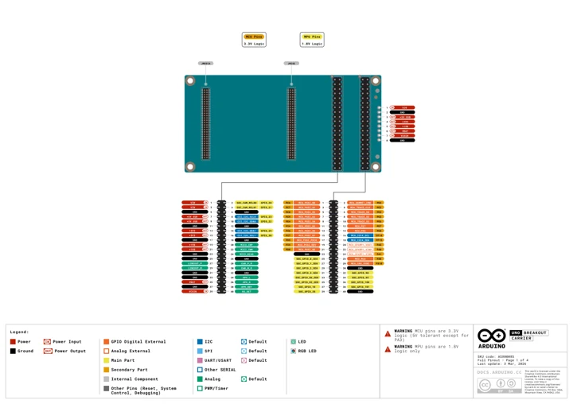
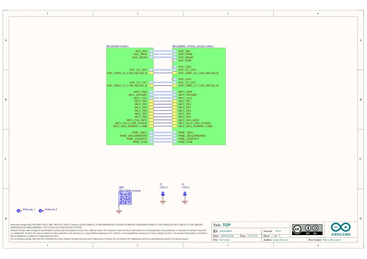
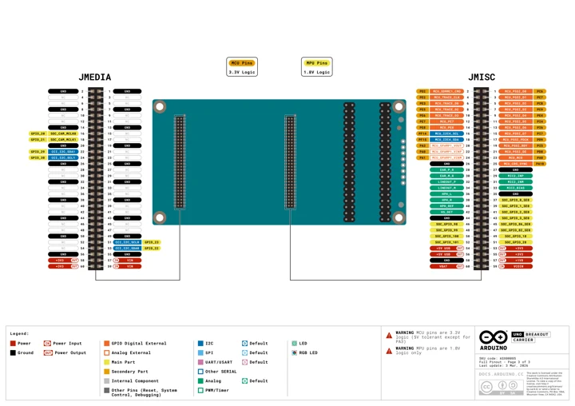

# UNO Breakout Carrier

**Arduino** · Passive UNO Q carrier; MCU and MPU signals have different logic voltages

Revision: Match revision in each original source

Coverage: Manufacturer references reviewed by scope; independent electrical and all-connector review pending

[Browse all manufacturers](../../../../BROWSE.md) · [Devices & IoT](../../../../DEVICES.md) · [Open in the browser guide](https://valleytech-black-wire-guide.pages.dev/?board=arduino-uno-breakout-carrier)

## Datasheets and original documentation

Board datasheet: **not yet recorded**. Visual reference: **available**.

[Manufacturer hardware documentation](https://docs.arduino.cc/hardware/uno-breakout-carrier/)

- **hardware-guide / board**: [Pinout (PDF)](https://docs.arduino.cc/resources/pinouts/ASX00085-full-pinout.pdf) · [saved document](../../../../library/media/c241620ba9e1d9d8cf5bcceba2a87c1ef0564fc52d9af120476d23e1fe7c24f5.pdf)
- **schematic / board**: [Schematics](https://docs.arduino.cc/resources/schematics/ASX00085-schematics.pdf) · [saved document](../../../../library/media/273e307e2207608bf0c0e7635a44518b7f6501e055a18c34642c4be77f11c5ce.pdf)
- **hardware-guide / board**: [Manufacturer pin and hardware documentation](https://docs.arduino.cc/hardware/uno-breakout-carrier/) · online

A chip datasheet, schematic and board datasheet have different scopes. Match the exact hardware revision.

[Documentation coverage and remaining gaps](../../../../DOCUMENTATION.md)

## Pinout (PDF)

**original reference PDF** · Source identity and visual scope inspected; PDF review covers first-page preview. Independent electrical and all-connector completeness review pending. · PDF

[Open original reference](../../../../library/media/c241620ba9e1d9d8cf5bcceba2a87c1ef0564fc52d9af120476d23e1fe7c24f5.pdf)

**Credit and rights:** Arduino; CC BY-SA 4.0 as stated in the source PDF. Original artwork and attribution retained.. Source/manufacturer: Arduino.

[Source 1](https://docs.arduino.cc/resources/pinouts/ASX00085-full-pinout.pdf) · [Source 2](https://docs.arduino.cc/hardware/uno-breakout-carrier/)

Manufacturer source retained unchanged. Source identity and visual scope inspected; PDF review covers first-page preview. Independent electrical and all-connector completeness review pending. The actual PDF has three pages; the first page footer says four. Advanced connector functions and mixed 3.3 V MCU / 1.8 V MPU logic are documented in the original.

Image revision: As supplied in the original; match exact board revision

SHA-256: `c241620ba9e1d9d8cf5bcceba2a87c1ef0564fc52d9af120476d23e1fe7c24f5`

## Schematics

**original reference PDF** · Source identity and visual scope inspected; PDF review covers first-page preview. Independent electrical and all-connector completeness review pending. · PDF

[Open original reference](../../../../library/media/273e307e2207608bf0c0e7635a44518b7f6501e055a18c34642c4be77f11c5ce.pdf)

**Credit and rights:** Manufacturer artwork; reuse and print rights not established. Inclusion does not relicense the original.. Source/manufacturer: Arduino.

[Source 1](https://docs.arduino.cc/resources/schematics/ASX00085-schematics.pdf) · [Source 2](https://docs.arduino.cc/hardware/uno-breakout-carrier/)

Manufacturer source retained unchanged. Source identity and visual scope inspected; PDF review covers first-page preview. Independent electrical and all-connector completeness review pending.

Image revision: As supplied in the original; match exact board revision

SHA-256: `273e307e2207608bf0c0e7635a44518b7f6501e055a18c34642c4be77f11c5ce`

## UNO Breakout Carrier pinout - PDF page 1

**pinout image** · Rendered page visually reviewed against the original; electrical and complete-device approval pending · PNG

[Open original reference](../../../../library/media/169b325d88407ff9e399a3da0d9c74dd8044208c5653fbf8facdf75cdd5fc798.png)

**Credit and rights:** Arduino; CC BY-SA 4.0 as stated in the source PDF. Original artwork and attribution retained.. Source/manufacturer: Arduino.

[Source 1](https://docs.arduino.cc/resources/pinouts/ASX00085-full-pinout.pdf) · [Source 2](https://docs.arduino.cc/hardware/uno-breakout-carrier/)

Uncropped render of original PDF page 1. Connector scope is limited to this page. Advanced functions on page 3 may not be supported by Arduino software. Mixed MCU/MPU logic levels; retain all source cautions.

Image revision: As supplied in the original; match exact board revision

SHA-256: `169b325d88407ff9e399a3da0d9c74dd8044208c5653fbf8facdf75cdd5fc798`

## UNO Breakout Carrier pinout - PDF page 3

**pinout image** · Rendered page visually reviewed against the original; electrical and complete-device approval pending · PNG

[Open original reference](../../../../library/media/51c43d75f07dbfa9abe8f8c3082b58dd7dd5b8769f6e72da611d96d585d8a952.png)

**Credit and rights:** Arduino; CC BY-SA 4.0 as stated in the source PDF. Original artwork and attribution retained.. Source/manufacturer: Arduino.

[Source 1](https://docs.arduino.cc/resources/pinouts/ASX00085-full-pinout.pdf) · [Source 2](https://docs.arduino.cc/hardware/uno-breakout-carrier/)

Uncropped render of original PDF page 3. Connector scope is limited to this page. Advanced functions on page 3 may not be supported by Arduino software. Mixed MCU/MPU logic levels; retain all source cautions.

Image revision: As supplied in the original; match exact board revision

SHA-256: `51c43d75f07dbfa9abe8f8c3082b58dd7dd5b8769f6e72da611d96d585d8a952`

Pin assignments have not been independently electrically verified. Check board revision before wiring.
