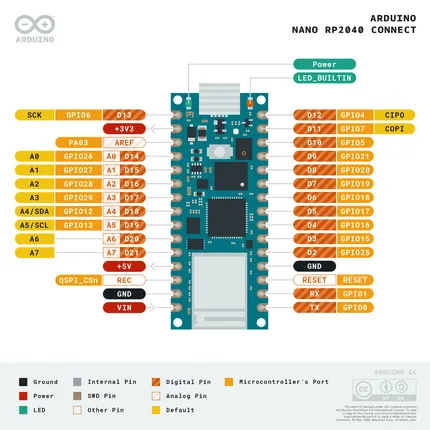
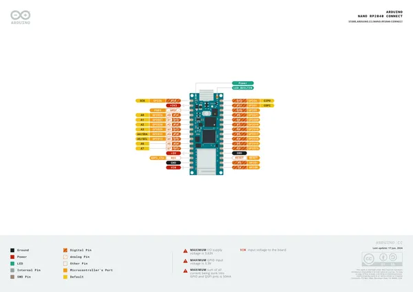
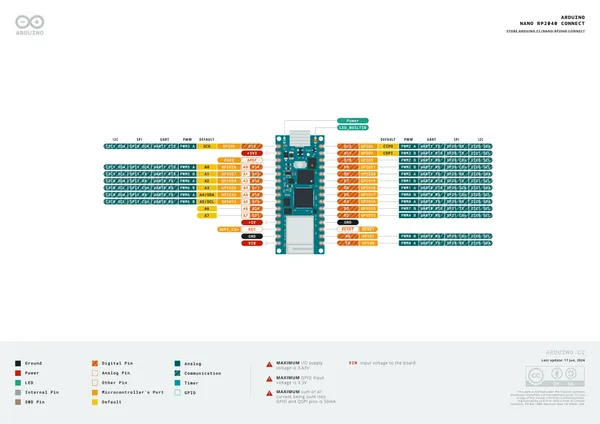
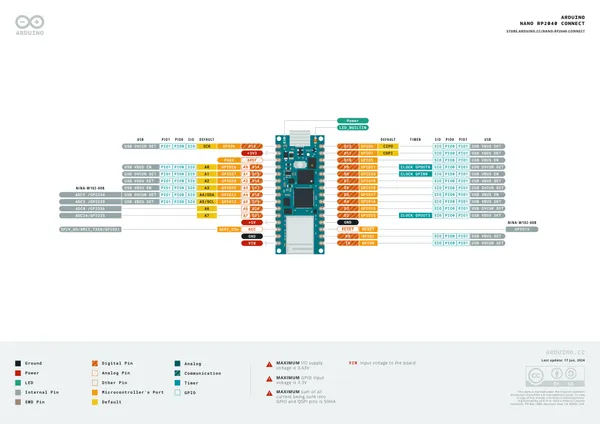
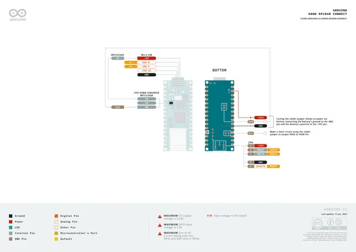
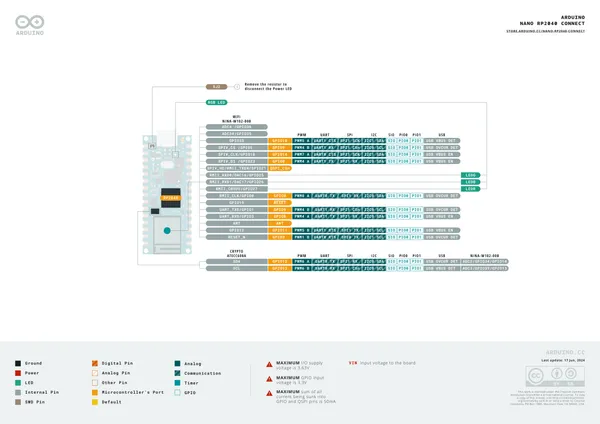
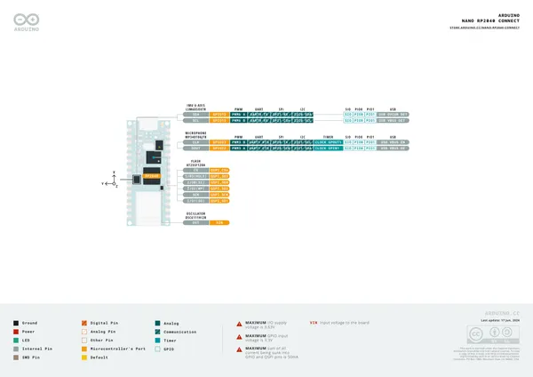

# Nano RP2040 Connect

**Arduino** · RP2040

Revision: Not identified  
Coverage: Pinout image collected

[Browse all manufacturers](../../../../BROWSE.md) · [Desktop app](https://github.com/valleytechsolutions/black-wire-desktop)

## Physical board pinout

**pinout image** · Reviewed source · PNG

[Open original reference](../../../../library/media/d6264d4eb5a088fb6b39e1768e2fe397053a8b7c50962b98f1ddf75b465a1ecd.png)

**Credit and rights:** Not established; source attribution retained. Source/manufacturer: Arduino.

[Source 1](https://content.arduino.cc/assets/Pinout_NanoRP2040_latest%20%281%29.png) · [Source 2](https://store-usa.arduino.cc/products/arduino-nano-rp2040-connect)

Discovered from CircuitPython board metadata and the linked product/documentation page. Exact hardware revision requires matching to the diagram.

SHA-256: `d6264d4eb5a088fb6b39e1768e2fe397053a8b7c50962b98f1ddf75b465a1ecd`

## pinout

**pinout image** · Reviewed source · PNG

[Open original reference](../../../../library/media/39ce33dc1e3809647df80e3b93275e0e1a582852981cb0137456ae47cb04db61.png)

**Credit and rights:** Not established; source attribution retained. Source/manufacturer: Arduino.

[Source 1](https://raw.githubusercontent.com/arduino/docs-content/dab66ecbd6ad52cd742da6c19c5b6330a7f2caae/content/hardware/nano/boards/nano-rp2040-connect/tutorials/rp2040-01-technical-reference/assets/pinout.png) · [Source 2](https://docs.arduino.cc/hardware/nano-rp2040-connect/) · [Source 3](https://github.com/arduino/docs-content/blob/dab66ecbd6ad52cd742da6c19c5b6330a7f2caae/content/hardware/nano/boards/nano-rp2040-connect/product.md) · [Source 4](https://github.com/arduino/docs-content/blob/dab66ecbd6ad52cd742da6c19c5b6330a7f2caae/content/hardware/nano/boards/nano-rp2040-connect/tutorials/rp2040-01-technical-reference/assets/pinout.png)

Official Arduino documentation repository pinned at dab66ecbd6ad52cd742da6c19c5b6330a7f2caae. Match the board model, SKU and revision printed on each source sheet; lifecycle is not inferred from repository folder placement.

SHA-256: `39ce33dc1e3809647df80e3b93275e0e1a582852981cb0137456ae47cb04db61`

## Official full pinout - page 1

**pinout image** · Reviewed source · PNG

[Open original reference](../../../../library/media/dfaa90cb7778fdf56dc838e47f4b2b68f57b6c31d488e0d202765df26f9ba420.png)

**Credit and rights:** CC BY-SA 4.0 notice printed in the original PDF; preserve attribution and verify scope for publication.. Source/manufacturer: Arduino.

[Source 1](https://raw.githubusercontent.com/arduino/docs-content/dab66ecbd6ad52cd742da6c19c5b6330a7f2caae/content/hardware/nano/boards/nano-rp2040-connect/downloads/ABX00053-full-pinout.pdf) · [Source 2](https://docs.arduino.cc/hardware/nano-rp2040-connect/) · [Source 3](https://github.com/arduino/docs-content/blob/dab66ecbd6ad52cd742da6c19c5b6330a7f2caae/content/hardware/nano/boards/nano-rp2040-connect/product.md) · [Source 4](https://github.com/arduino/docs-content/blob/dab66ecbd6ad52cd742da6c19c5b6330a7f2caae/content/hardware/nano/boards/nano-rp2040-connect/downloads/ABX00053-full-pinout.pdf)

Official Arduino documentation repository pinned at dab66ecbd6ad52cd742da6c19c5b6330a7f2caae. Match the board model, SKU and revision printed on each source sheet; lifecycle is not inferred from repository folder placement. Original PDF page 1 rendered at 220 dpi; no labels changed.

SHA-256: `dfaa90cb7778fdf56dc838e47f4b2b68f57b6c31d488e0d202765df26f9ba420`

## Official full pinout - page 2

**pinout image** · Reviewed source · PNG

[Open original reference](../../../../library/media/7f0b9ba4dc4314d7fe16f2f9560be7296830872a22970d482645bfd49c7ee700.png)

**Credit and rights:** CC BY-SA 4.0 notice printed in the original PDF; preserve attribution and verify scope for publication.. Source/manufacturer: Arduino.

[Source 1](https://raw.githubusercontent.com/arduino/docs-content/dab66ecbd6ad52cd742da6c19c5b6330a7f2caae/content/hardware/nano/boards/nano-rp2040-connect/downloads/ABX00053-full-pinout.pdf) · [Source 2](https://docs.arduino.cc/hardware/nano-rp2040-connect/) · [Source 3](https://github.com/arduino/docs-content/blob/dab66ecbd6ad52cd742da6c19c5b6330a7f2caae/content/hardware/nano/boards/nano-rp2040-connect/product.md) · [Source 4](https://github.com/arduino/docs-content/blob/dab66ecbd6ad52cd742da6c19c5b6330a7f2caae/content/hardware/nano/boards/nano-rp2040-connect/downloads/ABX00053-full-pinout.pdf)

Official Arduino documentation repository pinned at dab66ecbd6ad52cd742da6c19c5b6330a7f2caae. Match the board model, SKU and revision printed on each source sheet; lifecycle is not inferred from repository folder placement. Original PDF page 2 rendered at 220 dpi; no labels changed.

SHA-256: `7f0b9ba4dc4314d7fe16f2f9560be7296830872a22970d482645bfd49c7ee700`

## Official full pinout - page 3

**pinout image** · Reviewed source · PNG

[Open original reference](../../../../library/media/d4f47cb45ad3ca014373d33856475cbc97e91042c274a1037fd6d564f06e7b27.png)

**Credit and rights:** CC BY-SA 4.0 notice printed in the original PDF; preserve attribution and verify scope for publication.. Source/manufacturer: Arduino.

[Source 1](https://raw.githubusercontent.com/arduino/docs-content/dab66ecbd6ad52cd742da6c19c5b6330a7f2caae/content/hardware/nano/boards/nano-rp2040-connect/downloads/ABX00053-full-pinout.pdf) · [Source 2](https://docs.arduino.cc/hardware/nano-rp2040-connect/) · [Source 3](https://github.com/arduino/docs-content/blob/dab66ecbd6ad52cd742da6c19c5b6330a7f2caae/content/hardware/nano/boards/nano-rp2040-connect/product.md) · [Source 4](https://github.com/arduino/docs-content/blob/dab66ecbd6ad52cd742da6c19c5b6330a7f2caae/content/hardware/nano/boards/nano-rp2040-connect/downloads/ABX00053-full-pinout.pdf)

Official Arduino documentation repository pinned at dab66ecbd6ad52cd742da6c19c5b6330a7f2caae. Match the board model, SKU and revision printed on each source sheet; lifecycle is not inferred from repository folder placement. Original PDF page 3 rendered at 220 dpi; no labels changed.

SHA-256: `d4f47cb45ad3ca014373d33856475cbc97e91042c274a1037fd6d564f06e7b27`

## Official full pinout - page 6

**pinout image** · Reviewed source · PNG

[Open original reference](../../../../library/media/223c5494051ff2e4db21a67026d89984d21dcacfdfbfe0ecebc154dca38b0099.png)

**Credit and rights:** CC BY-SA 4.0 notice printed in the original PDF; preserve attribution and verify scope for publication.. Source/manufacturer: Arduino.

[Source 1](https://raw.githubusercontent.com/arduino/docs-content/dab66ecbd6ad52cd742da6c19c5b6330a7f2caae/content/hardware/nano/boards/nano-rp2040-connect/downloads/ABX00053-full-pinout.pdf) · [Source 2](https://docs.arduino.cc/hardware/nano-rp2040-connect/) · [Source 3](https://github.com/arduino/docs-content/blob/dab66ecbd6ad52cd742da6c19c5b6330a7f2caae/content/hardware/nano/boards/nano-rp2040-connect/product.md) · [Source 4](https://github.com/arduino/docs-content/blob/dab66ecbd6ad52cd742da6c19c5b6330a7f2caae/content/hardware/nano/boards/nano-rp2040-connect/downloads/ABX00053-full-pinout.pdf)

Official Arduino documentation repository pinned at dab66ecbd6ad52cd742da6c19c5b6330a7f2caae. Match the board model, SKU and revision printed on each source sheet; lifecycle is not inferred from repository folder placement. Original PDF page 6 rendered at 220 dpi; no labels changed.

SHA-256: `223c5494051ff2e4db21a67026d89984d21dcacfdfbfe0ecebc154dca38b0099`

## Official full pinout - page 4

**GPIO reference image** · Reviewed source · PNG

[Open original reference](../../../../library/media/701da313fb4311ca447f2ec20f7993974bc10928bd63464d92dc15dae122f4ee.png)

**Credit and rights:** CC BY-SA 4.0 notice printed in the original PDF; preserve attribution and verify scope for publication.. Source/manufacturer: Arduino.

[Source 1](https://raw.githubusercontent.com/arduino/docs-content/dab66ecbd6ad52cd742da6c19c5b6330a7f2caae/content/hardware/nano/boards/nano-rp2040-connect/downloads/ABX00053-full-pinout.pdf) · [Source 2](https://docs.arduino.cc/hardware/nano-rp2040-connect/) · [Source 3](https://github.com/arduino/docs-content/blob/dab66ecbd6ad52cd742da6c19c5b6330a7f2caae/content/hardware/nano/boards/nano-rp2040-connect/product.md) · [Source 4](https://github.com/arduino/docs-content/blob/dab66ecbd6ad52cd742da6c19c5b6330a7f2caae/content/hardware/nano/boards/nano-rp2040-connect/downloads/ABX00053-full-pinout.pdf)

Official Arduino documentation repository pinned at dab66ecbd6ad52cd742da6c19c5b6330a7f2caae. Match the board model, SKU and revision printed on each source sheet; lifecycle is not inferred from repository folder placement. Original PDF page 4 rendered at 220 dpi; no labels changed.

SHA-256: `701da313fb4311ca447f2ec20f7993974bc10928bd63464d92dc15dae122f4ee`

## Official full pinout - page 5

**GPIO reference image** · Reviewed source · PNG

[Open original reference](../../../../library/media/56a623addd23e17a566fd03c0b9f098fd8fccbf3013ac0d72b1281432127155c.png)

**Credit and rights:** CC BY-SA 4.0 notice printed in the original PDF; preserve attribution and verify scope for publication.. Source/manufacturer: Arduino.

[Source 1](https://raw.githubusercontent.com/arduino/docs-content/dab66ecbd6ad52cd742da6c19c5b6330a7f2caae/content/hardware/nano/boards/nano-rp2040-connect/downloads/ABX00053-full-pinout.pdf) · [Source 2](https://docs.arduino.cc/hardware/nano-rp2040-connect/) · [Source 3](https://github.com/arduino/docs-content/blob/dab66ecbd6ad52cd742da6c19c5b6330a7f2caae/content/hardware/nano/boards/nano-rp2040-connect/product.md) · [Source 4](https://github.com/arduino/docs-content/blob/dab66ecbd6ad52cd742da6c19c5b6330a7f2caae/content/hardware/nano/boards/nano-rp2040-connect/downloads/ABX00053-full-pinout.pdf)

Official Arduino documentation repository pinned at dab66ecbd6ad52cd742da6c19c5b6330a7f2caae. Match the board model, SKU and revision printed on each source sheet; lifecycle is not inferred from repository folder placement. Original PDF page 5 rendered at 220 dpi; no labels changed.

SHA-256: `56a623addd23e17a566fd03c0b9f098fd8fccbf3013ac0d72b1281432127155c`

## Full board pinout PDF

**original reference PDF** · Reviewed source · PDF

[Open original reference](../../../../library/media/3deceec024b7f12b3fcc8ab6bf62cb0d0fff68691ff1948142baf26b602cff63.pdf)

**Credit and rights:** Not established; source attribution retained. Source/manufacturer: Arduino.

[Source 1](https://raw.githubusercontent.com/arduino/docs-content/dab66ecbd6ad52cd742da6c19c5b6330a7f2caae/content/hardware/nano/boards/nano-rp2040-connect/downloads/ABX00053-full-pinout.pdf) · [Source 2](https://docs.arduino.cc/hardware/nano-rp2040-connect/) · [Source 3](https://github.com/arduino/docs-content/blob/dab66ecbd6ad52cd742da6c19c5b6330a7f2caae/content/hardware/nano/boards/nano-rp2040-connect/product.md) · [Source 4](https://github.com/arduino/docs-content/blob/dab66ecbd6ad52cd742da6c19c5b6330a7f2caae/content/hardware/nano/boards/nano-rp2040-connect/downloads/ABX00053-full-pinout.pdf)

Official Arduino documentation repository pinned at dab66ecbd6ad52cd742da6c19c5b6330a7f2caae. Match the board model, SKU and revision printed on each source sheet; lifecycle is not inferred from repository folder placement.

SHA-256: `3deceec024b7f12b3fcc8ab6bf62cb0d0fff68691ff1948142baf26b602cff63`

Pin assignments have not been independently electrically verified. Check board revision before wiring.
