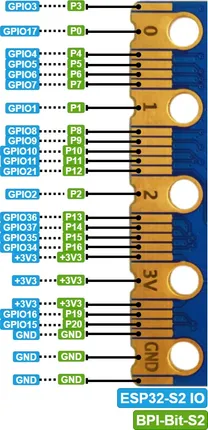

# BPI-Bit-S2

**Banana Pi** · ESP32-S2

Revision: Not identified  
Coverage: Partial pinout collected; full reference still needed

[Browse all manufacturers](../../../../BROWSE.md) · [Desktop app](https://github.com/valleytechsolutions/black-wire-desktop)

## GPIO header pinout

**pinout image** · Reviewed source · JPG

[Open original reference](../../../../library/media/eb878e8f1555c89a7a3ef4681776bd0867d77ab50daaad84ff470bdc16ede686.jpg)

**Credit and rights:** Not established; source attribution retained. Source/manufacturer: Banana Pi.

[Source 1](https://docs.banana-pi.org/picture/bpi_bit_v2_goldfinger.jpg) · [Source 2](https://docs.banana-pi.org/en/BPI-Bit-S2/BananaPi_BPI-Bit-S2)

¶ Goldfinger GPIO define

**Partial diagram. Confirm missing pins against the exact board documentation.**

SHA-256: `eb878e8f1555c89a7a3ef4681776bd0867d77ab50daaad84ff470bdc16ede686`

Pin assignments have not been independently electrically verified. Check board revision before wiring.
