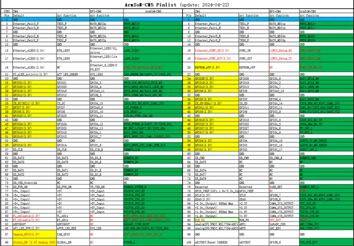
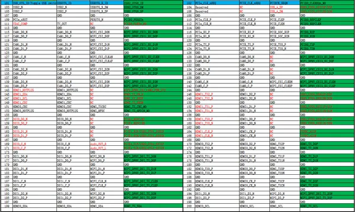

# BPI-CM5 Pro

**Banana Pi** · Other SBC

Revision: Not identified  
Coverage: Pinout image collected

[Browse all manufacturers](../../../../BROWSE.md) · [Desktop app](https://github.com/valleytechsolutions/black-wire-desktop)

## GPIO header pinout

**pinout image** · Reviewed source · PNG

[Open original reference](../../../../library/media/08afe3f9b949f821051bc85dd4501b868b599176cb571c613ed8267dcdb8096b.png)

**Credit and rights:** Not established; source attribution retained. Source/manufacturer: Banana Pi.

[Source 1](https://docs.banana-pi.org/bpi-cm5_pro/cm5-pinlist-1.png) · [Source 2](https://docs.banana-pi.org/en/BPI-CM5_Pro/BananaPi_BPI-CM5_Pro)

¶ BPI-CM5 Pro core board pin definitions

SHA-256: `08afe3f9b949f821051bc85dd4501b868b599176cb571c613ed8267dcdb8096b`

## GPIO header pinout

**pinout image** · Reviewed source · PNG

[Open original reference](../../../../library/media/ab9714b763930337ed4ae056471bc620f9cfd9c98d29bd83e85c7ecfe2d0fc58.png)

**Credit and rights:** Not established; source attribution retained. Source/manufacturer: Banana Pi.

[Source 1](https://docs.banana-pi.org/bpi-cm5_pro/cm5-pinlist-2.png) · [Source 2](https://docs.banana-pi.org/en/BPI-CM5_Pro/BananaPi_BPI-CM5_Pro)

¶ BPI-CM5 Pro core board pin definitions

SHA-256: `ab9714b763930337ed4ae056471bc620f9cfd9c98d29bd83e85c7ecfe2d0fc58`

Pin assignments have not been independently electrically verified. Check board revision before wiring.
