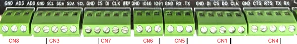

# BPI-F4

**Banana Pi** · Other SBC

Revision: Not identified

Coverage: Pinout image collected

[Browse all manufacturers](../../../../BROWSE.md) · [Devices & IoT](../../../../DEVICES.md) · [Open in the browser guide](https://valleytech-black-wire-guide.pages.dev/?board=banana-pi-other-sbc-bpi-f4)

Architecture: **ARM**

## Specifications and hardware documentation

- [Manufacturer hardware documentation](https://docs.banana-pi.org/en/BPI-F4/BananaPi_BPI-F4)

## GPIO header pinout

**pinout image** · Reviewed source · PNG

[Open original reference](../../../../library/media/678dba4d053041d0b384320c3015e22f84e12e8559625794ab183af6000771f9.png)

**Credit and rights:** Not established; source attribution retained. Source/manufacturer: Banana Pi.

[Source 1](https://docs.banana-pi.org/bpi-f4/bpi-f4-gpio.png) · [Source 2](https://docs.banana-pi.org/en/BPI-F4/BananaPi_BPI-F4)

¶ GPIO pin definitions

Image revision: Not identified

SHA-256: `678dba4d053041d0b384320c3015e22f84e12e8559625794ab183af6000771f9`

Pin assignments have not been independently electrically verified. Check board revision before wiring.
