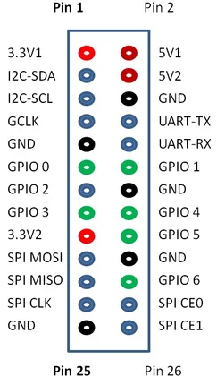
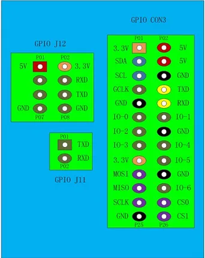

# BPI-M1

**Banana Pi** · Other SBC

Revision: Not identified

Coverage: Pinout image collected

[Browse all manufacturers](../../../../BROWSE.md) · [Devices & IoT](../../../../DEVICES.md) · [Open in the browser guide](https://valleytech-black-wire-guide.pages.dev/?board=banana-pi-other-sbc-bpi-m1)

Architecture: **ARM**

## Specifications and hardware documentation

- [Manufacturer hardware documentation](https://docs.banana-pi.org/en/BPI-M1/BananaPi_BPI-M1)

## GPIO header pinout

**pinout image** · Reviewed source · PNG

[Open original reference](../../../../library/media/763fe08fb7823091c046f6ad62f99bed45fa98c2adecc33b1c2c847230b8e750.png)

**Credit and rights:** Not established; source attribution retained. Source/manufacturer: Banana Pi.

[Source 1](https://docs.banana-pi.org/picture/bpi-m1_26_pin.png) · [Source 2](https://docs.banana-pi.org/en/BPI-M1/BananaPi_BPI-M1)

¶ GPIO Pin Define

Image revision: Not identified

SHA-256: `763fe08fb7823091c046f6ad62f99bed45fa98c2adecc33b1c2c847230b8e750`

## GPIO header pinout

**pinout image** · Reviewed source · PNG

[Open original reference](../../../../library/media/fc9cfb7289ad1be072fbdffbd5231283852a9dddf393d575e0b36ce230be0271.png)

**Credit and rights:** Not established; source attribution retained. Source/manufacturer: Banana Pi.

[Source 1](https://docs.banana-pi.org/picture/bpi-m1_all_pin.png) · [Source 2](https://docs.banana-pi.org/en/BPI-M1/BananaPi_BPI-M1)

¶ All GPIO define list

Image revision: Not identified

SHA-256: `fc9cfb7289ad1be072fbdffbd5231283852a9dddf393d575e0b36ce230be0271`

Pin assignments have not been independently electrically verified. Check board revision before wiring.
