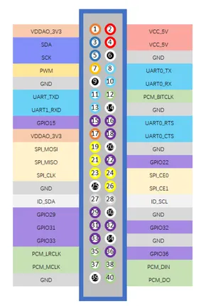

# BPI-M4 Berry

**Banana Pi** · Other SBC

Revision: Not identified  
Coverage: Pinout image collected

[Browse all manufacturers](../../../../BROWSE.md) · [Desktop app](https://github.com/valleytechsolutions/black-wire-desktop)

## GPIO header pinout

**pinout image** · Reviewed source · PNG

[Open original reference](../../../../library/media/074f2a117ce2df7d5c8ea8330b71b552b1bad1cb772f5291da57f5dac73297b9.png)

**Credit and rights:** Not established; source attribution retained. Source/manufacturer: Banana Pi.

[Source 1](https://docs.banana-pi.org/bpi-m4berry/bananapi_m4_berry_gpio_picture.png) · [Source 2](https://docs.banana-pi.org/en/BPI-M4_Berry/BananaPi_BPI-M4_Berry)

¶ GPIO Pin Define

SHA-256: `074f2a117ce2df7d5c8ea8330b71b552b1bad1cb772f5291da57f5dac73297b9`

Pin assignments have not been independently electrically verified. Check board revision before wiring.
