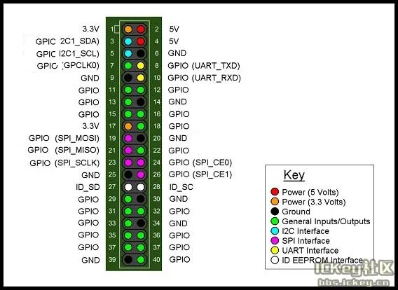

# BPI-R1

**Banana Pi** · Other SBC

Revision: Not identified

Coverage: Partial pinout collected; full reference still needed

[Browse all manufacturers](../../../../BROWSE.md) · [Devices & IoT](../../../../DEVICES.md) · [Open in the browser guide](https://valleytech-black-wire-guide.pages.dev/?board=banana-pi-other-sbc-bpi-r1)

Architecture: **ARM**

## Specifications and hardware documentation

- [Manufacturer hardware documentation](https://docs.banana-pi.org/en/BPI-R1/BananaPi_BPI-R1)

## GPIO header pinout

**pinout image** · Reviewed source · PNG

[Open original reference](../../../../library/media/ca2176f410bf9642829bd5129d1b3975410845cf29949d2d579a50e2a7da831e.png)

**Credit and rights:** Not established; source attribution retained. Source/manufacturer: Banana Pi.

[Source 1](https://docs.banana-pi.org/picture/gpio_define.png) · [Source 2](https://docs.banana-pi.org/en/BPI-R1/BananaPi_BPI-R1)

¶ BPI-R1 40PIN GPIO Manufacturer publishes this shared generic signal-label graphic under this exact board GPIO section. Does not supply SoC GPIO numbering; fuller model-specific map still needed.

Image revision: Not identified

SHA-256: `ca2176f410bf9642829bd5129d1b3975410845cf29949d2d579a50e2a7da831e`

Pin assignments have not been independently electrically verified. Check board revision before wiring.
