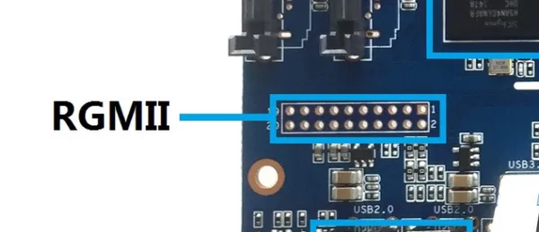

# BPI-W2

**Banana Pi** · Other SBC

Revision: Not identified

Coverage: Board labels only; pinout needed

[Browse all manufacturers](../../../../BROWSE.md) · [Devices & IoT](../../../../DEVICES.md) · [Open in the browser guide](https://valleytech-black-wire-guide.pages.dev/?board=banana-pi-other-sbc-bpi-w2)

Architecture: **ARM**

## Specifications and hardware documentation

- [Manufacturer hardware documentation](https://docs.banana-pi.org/en/BPI-W2/BananaPi_BPI-W2)

## Header orientation and board labels

**board labeling image** · Reviewed source · PNG

[Open original reference](../../../../library/media/930bc2385a62189eaa49d305002b8da8e5d1fa546a645392ad7d2000960e5aa6.png)

**Credit and rights:** Not established; source attribution retained. Source/manufacturer: Banana Pi.

[Source 1](https://docs.banana-pi.org/picture/rgmii_interface.png) · [Source 2](https://docs.banana-pi.org/en/BPI-W2/BananaPi_BPI-W2)

¶ RGMII Interface with PIN define

Image revision: Not identified

SHA-256: `930bc2385a62189eaa49d305002b8da8e5d1fa546a645392ad7d2000960e5aa6`

Pin assignments have not been independently electrically verified. Check board revision before wiring.
