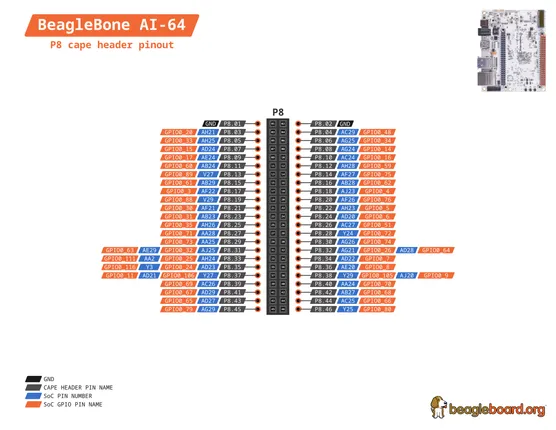
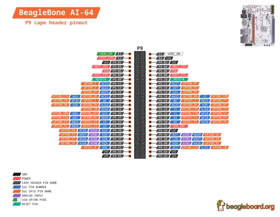

# BeagleBone AI-64

**BeagleBoard.org** · Other SBC

Revision: Not identified  
Coverage: Pinout image collected

[Browse all manufacturers](../../../../BROWSE.md) · [Desktop app](https://github.com/valleytechsolutions/black-wire-desktop)

## BeagleBone-AI-64-P8

**pinout image** · Reviewed source · PNG

[Open original reference](../../../../library/media/cecdfe3d8ba83ab9c9b57ea2170c4f5f8eb86893a63cec7174b34f9799f33cc8.png)

**Credit and rights:** Not established; source attribution retained. Source/manufacturer: BeagleBoard.org.

[Source 1](https://raw.githubusercontent.com/beagleboard/docs.beagleboard.io/16fe321218239da46f68cc6688347deddd044181/boards/beaglebone/ai-64/images/pinout/BeagleBone-AI-64-P8.png) · [Source 2](https://github.com/beagleboard/docs.beagleboard.io/blob/16fe321218239da46f68cc6688347deddd044181/boards/beaglebone/ai-64/images/pinout/BeagleBone-AI-64-P8.png)

SHA-256: `cecdfe3d8ba83ab9c9b57ea2170c4f5f8eb86893a63cec7174b34f9799f33cc8`

## BeagleBone-AI-64-P9

**pinout image** · Reviewed source · PNG

[Open original reference](../../../../library/media/e35258d2ff290994522cbdbe88dcc65f1b57c3ea41ee3c9b862285c1700d328b.png)

**Credit and rights:** Not established; source attribution retained. Source/manufacturer: BeagleBoard.org.

[Source 1](https://raw.githubusercontent.com/beagleboard/docs.beagleboard.io/16fe321218239da46f68cc6688347deddd044181/boards/beaglebone/ai-64/images/pinout/BeagleBone-AI-64-P9.png) · [Source 2](https://github.com/beagleboard/docs.beagleboard.io/blob/16fe321218239da46f68cc6688347deddd044181/boards/beaglebone/ai-64/images/pinout/BeagleBone-AI-64-P9.png)

SHA-256: `e35258d2ff290994522cbdbe88dcc65f1b57c3ea41ee3c9b862285c1700d328b`

Pin assignments have not been independently electrically verified. Check board revision before wiring.
