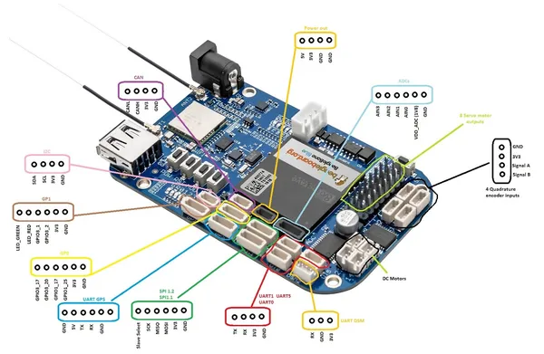
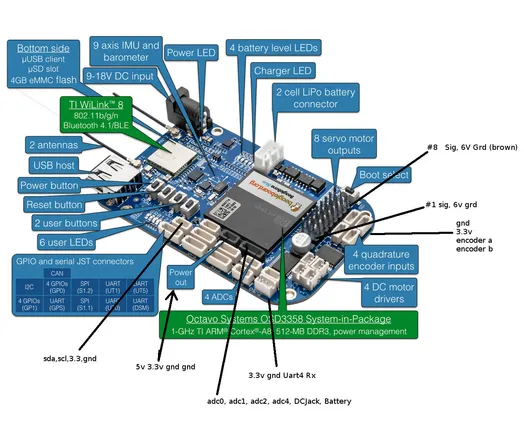

# BeagleBone Blue

**BeagleBoard.org** · Other SBC

Revision: Not identified  
Coverage: Pinout image collected

[Browse all manufacturers](../../../../BROWSE.md) · [Desktop app](https://github.com/valleytechsolutions/black-wire-desktop)

## pinout

**pinout image** · Reviewed source · JPG

[Open original reference](../../../../library/media/67bca5266bae5149fb208a247c8ce52a6db7b45a3ec5a1e8130cd82a7fa8998b.jpg)

**Credit and rights:** Not established; source attribution retained. Source/manufacturer: BeagleBoard.org.

[Source 1](https://raw.githubusercontent.com/beagleboard/docs.beagleboard.io/16fe321218239da46f68cc6688347deddd044181/boards/beaglebone/blue/images/pinout.jpg) · [Source 2](https://github.com/beagleboard/docs.beagleboard.io/blob/16fe321218239da46f68cc6688347deddd044181/boards/beaglebone/blue/images/pinout.jpg)

SHA-256: `67bca5266bae5149fb208a247c8ce52a6db7b45a3ec5a1e8130cd82a7fa8998b`

## Header orientation and board labels

**board labeling image** · Reviewed source · JPG

[Open original reference](../../../../library/media/367930e50da5d22b419e03a4407b0850972866cdd572df49e0152bfdae2323ef.jpg)

**Credit and rights:** Not established; source attribution retained. Source/manufacturer: BeagleBoard.org.

[Source 1](https://raw.githubusercontent.com/beagleboard/docs.beagleboard.io/16fe321218239da46f68cc6688347deddd044181/boards/beaglebone/blue/images/BeagleBone_Blue_pinouts.jpg) · [Source 2](https://github.com/beagleboard/docs.beagleboard.io/blob/16fe321218239da46f68cc6688347deddd044181/boards/beaglebone/blue/images/BeagleBone_Blue_pinouts.jpg)

SHA-256: `367930e50da5d22b419e03a4407b0850972866cdd572df49e0152bfdae2323ef`

Pin assignments have not been independently electrically verified. Check board revision before wiring.
