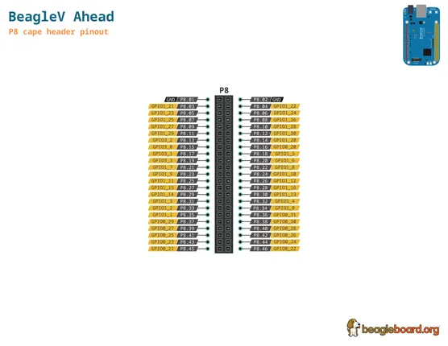
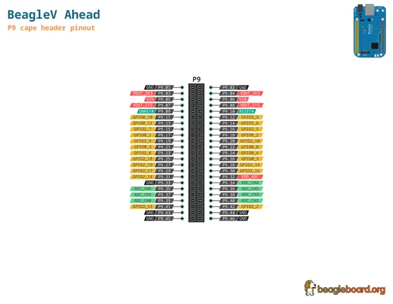

# BeagleV Ahead

**BeagleBoard.org** · Other SBC

Revision: Not identified  
Coverage: Pinout image collected

[Browse all manufacturers](../../../../BROWSE.md) · [Desktop app](https://github.com/valleytechsolutions/black-wire-desktop)

## BeagleV-Ahead-P8

**pinout image** · Reviewed source · PNG

[Open original reference](../../../../library/media/9e541a7153f1c051c70c32ab6a84455c796ab8106332a57bac6b692755875dc3.png)

**Credit and rights:** Not established; source attribution retained. Source/manufacturer: BeagleBoard.org.

[Source 1](https://raw.githubusercontent.com/beagleboard/docs.beagleboard.io/16fe321218239da46f68cc6688347deddd044181/boards/beaglev/ahead/images/pinout/BeagleV-Ahead-P8.png) · [Source 2](https://github.com/beagleboard/docs.beagleboard.io/blob/16fe321218239da46f68cc6688347deddd044181/boards/beaglev/ahead/images/pinout/BeagleV-Ahead-P8.png)

SHA-256: `9e541a7153f1c051c70c32ab6a84455c796ab8106332a57bac6b692755875dc3`

## BeagleV-Ahead-P9

**pinout image** · Reviewed source · PNG

[Open original reference](../../../../library/media/115930b5af2a44cd91b226d94cf8f80b6de59b1df9321dd97a152d797f51f497.png)

**Credit and rights:** Not established; source attribution retained. Source/manufacturer: BeagleBoard.org.

[Source 1](https://raw.githubusercontent.com/beagleboard/docs.beagleboard.io/16fe321218239da46f68cc6688347deddd044181/boards/beaglev/ahead/images/pinout/BeagleV-Ahead-P9.png) · [Source 2](https://github.com/beagleboard/docs.beagleboard.io/blob/16fe321218239da46f68cc6688347deddd044181/boards/beaglev/ahead/images/pinout/BeagleV-Ahead-P9.png)

SHA-256: `115930b5af2a44cd91b226d94cf8f80b6de59b1df9321dd97a152d797f51f497`

Pin assignments have not been independently electrically verified. Check board revision before wiring.
