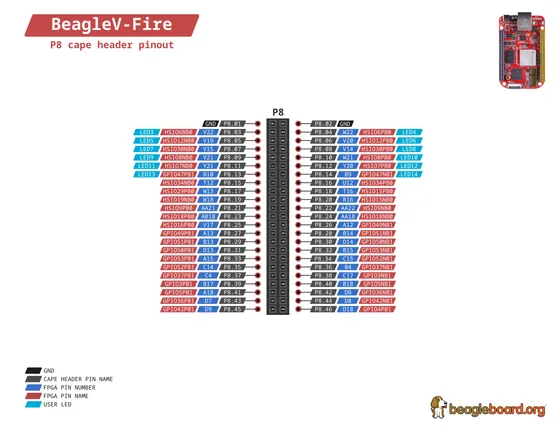
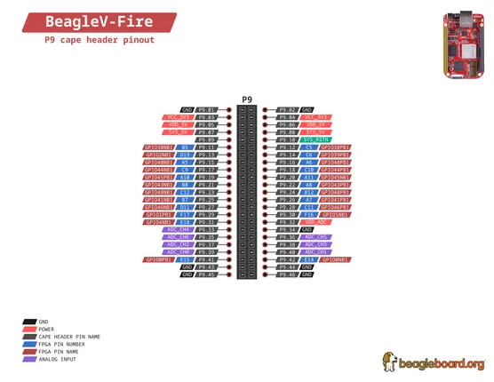

# BeagleV Fire

**BeagleBoard.org** · Other SBC

Revision: Not identified  
Coverage: Pinout image collected

[Browse all manufacturers](../../../../BROWSE.md) · [Desktop app](https://github.com/valleytechsolutions/black-wire-desktop)

## BeagleV-Fire-P8

**pinout image** · Reviewed source · PNG

[Open original reference](../../../../library/media/357194878d150f55e41a20c11b9b97e1d1220db4590bc69bf759c7b9c9095a94.png)

**Credit and rights:** Not established; source attribution retained. Source/manufacturer: BeagleBoard.org.

[Source 1](https://raw.githubusercontent.com/beagleboard/docs.beagleboard.io/16fe321218239da46f68cc6688347deddd044181/boards/beaglev/fire/images/pinout/BeagleV-Fire-P8.png) · [Source 2](https://github.com/beagleboard/docs.beagleboard.io/blob/16fe321218239da46f68cc6688347deddd044181/boards/beaglev/fire/images/pinout/BeagleV-Fire-P8.png)

SHA-256: `357194878d150f55e41a20c11b9b97e1d1220db4590bc69bf759c7b9c9095a94`

## BeagleV-Fire-P9

**pinout image** · Reviewed source · PNG

[Open original reference](../../../../library/media/7ef41f8c1536109fb748b334d0cd5c093bd14e5eb52acac85a5c72922dd0f6b3.png)

**Credit and rights:** Not established; source attribution retained. Source/manufacturer: BeagleBoard.org.

[Source 1](https://raw.githubusercontent.com/beagleboard/docs.beagleboard.io/16fe321218239da46f68cc6688347deddd044181/boards/beaglev/fire/images/pinout/BeagleV-Fire-P9.png) · [Source 2](https://github.com/beagleboard/docs.beagleboard.io/blob/16fe321218239da46f68cc6688347deddd044181/boards/beaglev/fire/images/pinout/BeagleV-Fire-P9.png)

SHA-256: `7ef41f8c1536109fb748b334d0cd5c093bd14e5eb52acac85a5c72922dd0f6b3`

Pin assignments have not been independently electrically verified. Check board revision before wiring.
