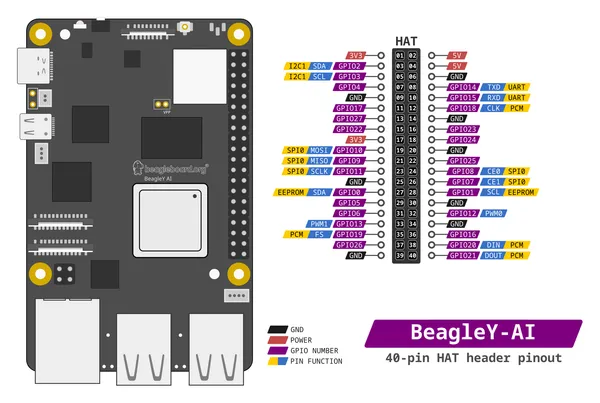
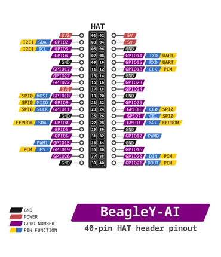

# BeagleY AI

**BeagleBoard.org** · Other SBC

Revision: Not identified

Coverage: Pinout image collected

[Browse all manufacturers](../../../../BROWSE.md) · [Devices & IoT](../../../../DEVICES.md) · [Open in the browser guide](https://valleytech-black-wire-guide.pages.dev/?board=beagleboard-org-other-sbc-beagley-ai)

Architecture: **ARM**

## Specifications and hardware documentation

- [Manufacturer hardware documentation](https://docs.beagleboard.org/boards/beagley/ai/index.html)

## beagley-ai-pinout

**pinout image** · Reviewed source · PNG

[Open original reference](../../../../library/media/0d1814586fc78ffaab8d58836d2965495b6d985815a257459b0762956371c945.png)

**Credit and rights:** Not established; source attribution retained. Source/manufacturer: BeagleBoard.org.

[Source 1](https://raw.githubusercontent.com/beagleboard/docs.beagleboard.io/16fe321218239da46f68cc6688347deddd044181/boards/beagley/ai/images/gpio/beagley-ai-pinout.png) · [Source 2](https://github.com/beagleboard/docs.beagleboard.io/blob/16fe321218239da46f68cc6688347deddd044181/boards/beagley/ai/images/gpio/beagley-ai-pinout.png)

Image revision: Not identified

SHA-256: `0d1814586fc78ffaab8d58836d2965495b6d985815a257459b0762956371c945`

## pinout

**pinout image** · Reviewed source · PNG

[Open original reference](../../../../library/media/ce5e8dd6b0ba6986c94839d234303abafbe0ceb7959a732a20011f9a5f4439f2.png)

**Credit and rights:** Not established; source attribution retained. Source/manufacturer: BeagleBoard.org.

[Source 1](https://raw.githubusercontent.com/beagleboard/docs.beagleboard.io/16fe321218239da46f68cc6688347deddd044181/boards/beagley/ai/images/gpio/pinout.png) · [Source 2](https://github.com/beagleboard/docs.beagleboard.io/blob/16fe321218239da46f68cc6688347deddd044181/boards/beagley/ai/images/gpio/pinout.png)

Image revision: Not identified

SHA-256: `ce5e8dd6b0ba6986c94839d234303abafbe0ceb7959a732a20011f9a5f4439f2`

Pin assignments have not been independently electrically verified. Check board revision before wiring.
