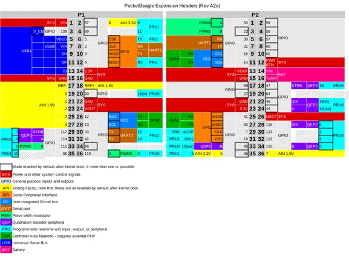

# PocketBeagle

**BeagleBoard.org** · Other SBC

Revision: Not identified  
Coverage: Pinout image collected

[Browse all manufacturers](../../../../BROWSE.md) · [Desktop app](https://github.com/valleytechsolutions/black-wire-desktop)

## PocketBeagle_pinout

**pinout image** · Reviewed source · PNG

[Open original reference](../../../../library/media/febc78052b97fc3fa4286b615d57d24b5293f690604ba326f3ec209566dcc89e.png)

**Credit and rights:** Not established; source attribution retained. Source/manufacturer: BeagleBoard.org.

[Source 1](https://raw.githubusercontent.com/beagleboard/docs.beagleboard.io/16fe321218239da46f68cc6688347deddd044181/boards/pocketbeagle/images/PocketBeagle_pinout.png) · [Source 2](https://github.com/beagleboard/docs.beagleboard.io/blob/16fe321218239da46f68cc6688347deddd044181/boards/pocketbeagle/images/PocketBeagle_pinout.png)

SHA-256: `febc78052b97fc3fa4286b615d57d24b5293f690604ba326f3ec209566dcc89e`

Pin assignments have not been independently electrically verified. Check board revision before wiring.
