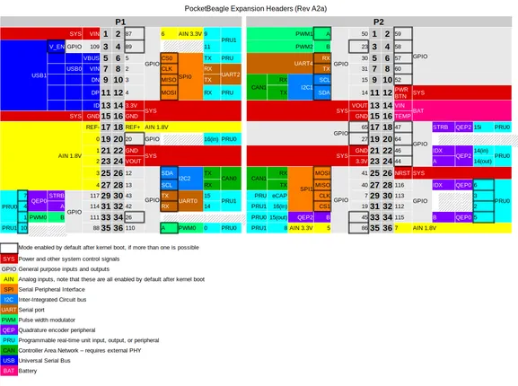

# PocketBeagle

**BeagleBoard.org** · Other SBC

Revision: Not identified

Coverage: Pinout image collected

[Browse all manufacturers](../../../../BROWSE.md) · [Devices & IoT](../../../../DEVICES.md) · [Open in the browser guide](https://valleytech-black-wire-guide.pages.dev/?board=beagleboard-org-other-sbc-pocketbeagle)

## Datasheets and original documentation

Board datasheet: **not yet recorded**. Visual reference: **available**.

Original manufacturer website still needs identification.

A chip datasheet, schematic and board datasheet have different scopes. Match the exact hardware revision.

[Documentation coverage and remaining gaps](../../../../DOCUMENTATION.md)

## PocketBeagle_pinout

**pinout image** · Reviewed source · PNG

[Open original reference](../../../../library/media/febc78052b97fc3fa4286b615d57d24b5293f690604ba326f3ec209566dcc89e.png)

**Credit and rights:** Not established; source attribution retained. Source/manufacturer: BeagleBoard.org.

[Source 1](https://raw.githubusercontent.com/beagleboard/docs.beagleboard.io/16fe321218239da46f68cc6688347deddd044181/boards/pocketbeagle/images/PocketBeagle_pinout.png) · [Source 2](https://github.com/beagleboard/docs.beagleboard.io/blob/16fe321218239da46f68cc6688347deddd044181/boards/pocketbeagle/images/PocketBeagle_pinout.png)

Image revision: Not identified

SHA-256: `febc78052b97fc3fa4286b615d57d24b5293f690604ba326f3ec209566dcc89e`

Pin assignments have not been independently electrically verified. Check board revision before wiring.
