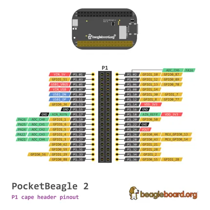
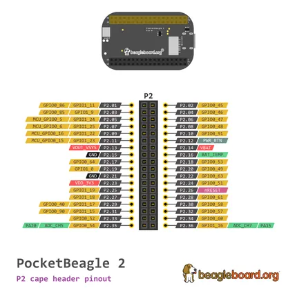

# PocketBeagle 2

**BeagleBoard.org** · Other SBC

Revision: Not identified  
Coverage: Pinout image collected

[Browse all manufacturers](../../../../BROWSE.md) · [Desktop app](https://github.com/valleytechsolutions/black-wire-desktop)

## PocketBeagle-2-P1

**pinout image** · Reviewed source · PNG

[Open original reference](../../../../library/media/21141ecf70811d26489265db04c7699bf632126a7a8a4b40a91382225c38f745.png)

**Credit and rights:** Not established; source attribution retained. Source/manufacturer: BeagleBoard.org.

[Source 1](https://raw.githubusercontent.com/beagleboard/docs.beagleboard.io/16fe321218239da46f68cc6688347deddd044181/boards/pocketbeagle-2/images/pinout/PocketBeagle-2-P1.png) · [Source 2](https://github.com/beagleboard/docs.beagleboard.io/blob/16fe321218239da46f68cc6688347deddd044181/boards/pocketbeagle-2/images/pinout/PocketBeagle-2-P1.png)

SHA-256: `21141ecf70811d26489265db04c7699bf632126a7a8a4b40a91382225c38f745`

## PocketBeagle-2-P2

**pinout image** · Reviewed source · PNG

[Open original reference](../../../../library/media/972ab4982913bc31ff042b18db477872038d9cd8f086034e0abb9957a6686ddf.png)

**Credit and rights:** Not established; source attribution retained. Source/manufacturer: BeagleBoard.org.

[Source 1](https://raw.githubusercontent.com/beagleboard/docs.beagleboard.io/16fe321218239da46f68cc6688347deddd044181/boards/pocketbeagle-2/images/pinout/PocketBeagle-2-P2.png) · [Source 2](https://github.com/beagleboard/docs.beagleboard.io/blob/16fe321218239da46f68cc6688347deddd044181/boards/pocketbeagle-2/images/pinout/PocketBeagle-2-P2.png)

SHA-256: `972ab4982913bc31ff042b18db477872038d9cd8f086034e0abb9957a6686ddf`

Pin assignments have not been independently electrically verified. Check board revision before wiring.
