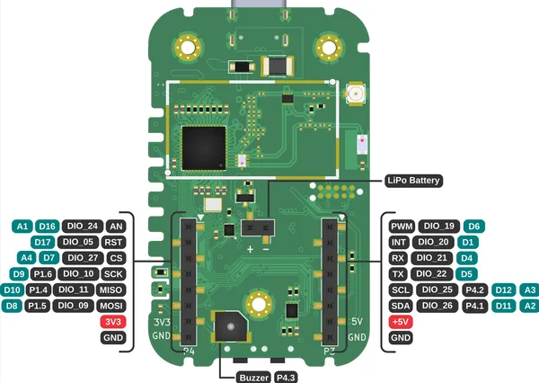
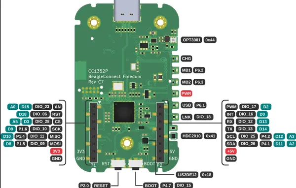

# BeagleConnect Freedom

**BeagleBoard.org** · Other

Revision: Not identified  
Coverage: Pinout image collected

[Browse all manufacturers](../../../../BROWSE.md) · [Desktop app](https://github.com/valleytechsolutions/black-wire-desktop)

## BeagleConnectFreedom-Back-Annotated-Arduino-Pinout

**pinout image** · Reviewed source · PNG

[Open original reference](../../../../library/media/6a45ddbc54ac55af5c98854e774325297e9b8fd54fc67e98382be492a403add4.png)

**Credit and rights:** Not established; source attribution retained. Source/manufacturer: BeagleBoard.org.

[Source 1](https://raw.githubusercontent.com/beagleboard/docs.beagleboard.io/16fe321218239da46f68cc6688347deddd044181/boards/beagleconnect/freedom/demos-and-tutorials/images/BeagleConnectFreedom-Back-Annotated-Arduino-Pinout.png) · [Source 2](https://github.com/beagleboard/docs.beagleboard.io/blob/16fe321218239da46f68cc6688347deddd044181/boards/beagleconnect/freedom/demos-and-tutorials/images/BeagleConnectFreedom-Back-Annotated-Arduino-Pinout.png)

SHA-256: `6a45ddbc54ac55af5c98854e774325297e9b8fd54fc67e98382be492a403add4`

## BeagleConnectFreedom-Front-Annotated-Arduino-Pinout

**pinout image** · Reviewed source · PNG

[Open original reference](../../../../library/media/8be337dd13879ee3eb1db5fb7d315ed4d90f135d694134d9bb36d1efa122682c.png)

**Credit and rights:** Not established; source attribution retained. Source/manufacturer: BeagleBoard.org.

[Source 1](https://raw.githubusercontent.com/beagleboard/docs.beagleboard.io/16fe321218239da46f68cc6688347deddd044181/boards/beagleconnect/freedom/demos-and-tutorials/images/BeagleConnectFreedom-Front-Annotated-Arduino-Pinout.png) · [Source 2](https://github.com/beagleboard/docs.beagleboard.io/blob/16fe321218239da46f68cc6688347deddd044181/boards/beagleconnect/freedom/demos-and-tutorials/images/BeagleConnectFreedom-Front-Annotated-Arduino-Pinout.png)

SHA-256: `8be337dd13879ee3eb1db5fb7d315ed4d90f135d694134d9bb36d1efa122682c`

Pin assignments have not been independently electrically verified. Check board revision before wiring.
