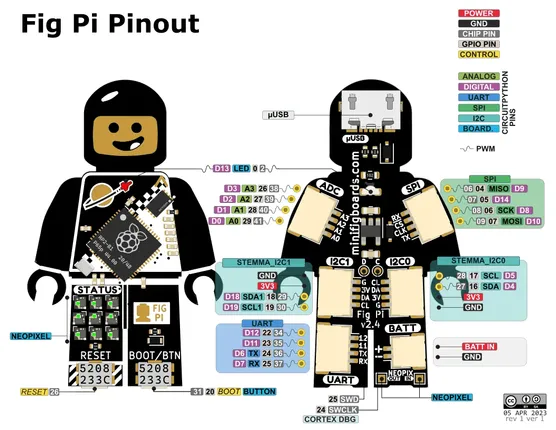

# FigPi

**Benjamin Shockley** · RP2040

Revision: Not identified

Coverage: Pinout image collected

[Browse all manufacturers](../../../../BROWSE.md) · [Devices & IoT](../../../../DEVICES.md) · [Open in the browser guide](https://valleytech-black-wire-guide.pages.dev/?board=benjamin-shockley-rp2040-figpi)

## Datasheets and original documentation

Board datasheet: **not yet recorded**. Visual reference: **available**.

Original manufacturer website still needs identification.

A chip datasheet, schematic and board datasheet have different scopes. Match the exact hardware revision.

[Documentation coverage and remaining gaps](../../../../DOCUMENTATION.md)

## Physical board pinout

**pinout image** · Reviewed source · PNG

[Open original reference](../../../../library/media/a9af3da866c0de29984b382383d82b03e89c184add3c353b5c0f95c786404133.png)

**Credit and rights:** Not established; source attribution retained. Source/manufacturer: Benjamin Shockley.

[Source 1](https://i0.wp.com/minifigboards.com/wp-content/uploads/2023/03/Fig_Pi_Pinout.png) · [Source 2](https://minifigboards.com/fig-pi)

Discovered from CircuitPython board metadata and the linked product/documentation page. Exact hardware revision requires matching to the diagram.

Image revision: Not identified

SHA-256: `a9af3da866c0de29984b382383d82b03e89c184add3c353b5c0f95c786404133`

Pin assignments have not been independently electrically verified. Check board revision before wiring.
