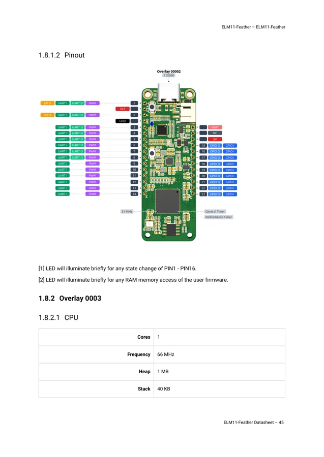
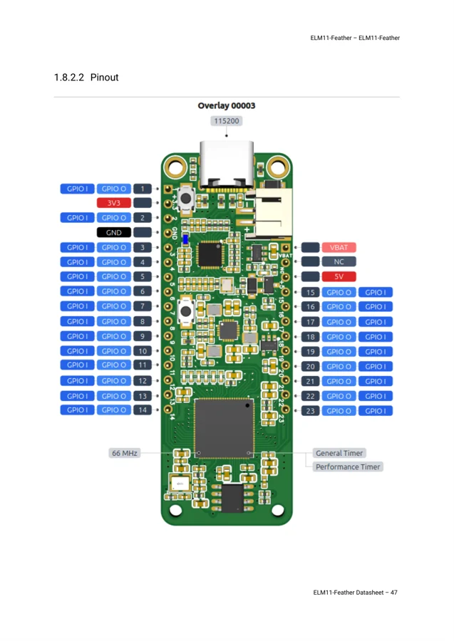
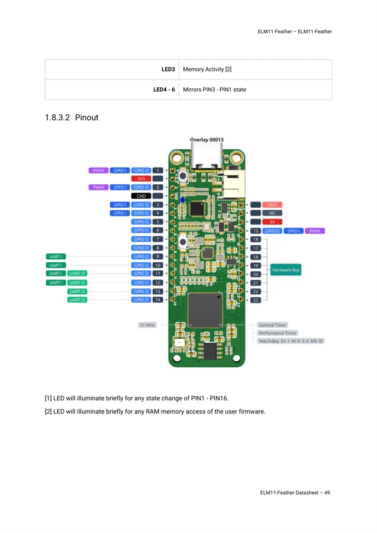

# ELM11 Feather

**BrisbaneSilicon** · GW1NR-9C / BL702

Revision: Datasheet 10 July 2026; match installed hardware overlay

Coverage: Physical pinout source collected; match revision and connector scope

[Browse all manufacturers](../../../../BROWSE.md) · [Devices & IoT](../../../../DEVICES.md) · [Open in the browser guide](https://valleytech-black-wire-guide.pages.dev/?board=brisbanesilicon-elm11-feather)

Architecture: **FPGA / RISC-V**

## Datasheets and original documentation

Board datasheet: **recorded**. Visual reference: **available**.

[Original manufacturer hardware documentation](https://www.crowdsupply.com/brisbanesilicon/elm11-feather)

- **datasheet / board**: [ELM11 Feather board datasheet — 10 July 2026](https://brisbanesilicon.com.au/docs/ELM11-Feather_Datasheet.pdf) · [saved document](../../../../library/media/dcba9575b84a69af08aec05f148bd1971c4e4b4396a70ae45b79976e5b92c2c6.pdf)
- **design-files / board**: [Board block diagram](https://brisbanesilicon.com.au/docs/ELM11-Feather_Block_Diagram.pdf) · [saved document](../../../../library/media/135f9de87d345c17bebb9eccfa4808ad6e4eb191bc577424078a12b20c4c0d4f.pdf)
- **design-files / board**: [Board dimensions](https://brisbanesilicon.com.au/docs/ELM11-Feather_Board_Dimensions.pdf) · [saved document](../../../../library/media/16b0288ec8f6fa9062972c613635f389ae08c1fdae1b7cbd5907d48fb048eeb8.pdf)

Creator campaign lists pre-orders with planned November 2026 fulfilment when checked. Pin functions vary by FPGA hardware overlay: 00002, 00003 and 00013 sheets are kept separate. An announced date is not a guaranteed shipping date.

[Documentation coverage and remaining gaps](../../../../DOCUMENTATION.md)

## Specifications and hardware documentation

- [Manufacturer hardware documentation](https://www.crowdsupply.com/brisbanesilicon/elm11-feather)

## ELM11 Feather board datasheet — 10 July 2026

**original reference PDF** · Reviewed source · PDF

[Open original reference](../../../../library/media/dcba9575b84a69af08aec05f148bd1971c4e4b4396a70ae45b79976e5b92c2c6.pdf)

**Credit and rights:** BrisbaneSilicon / original contributors. Asset-specific redistribution and print rights have not been established. Original artwork is not relicensed by Black Wire's editorial license.. Source/manufacturer: BrisbaneSilicon.

[Source 1](https://brisbanesilicon.com.au/docs/ELM11-Feather_Datasheet.pdf) · [Source 2](https://www.crowdsupply.com/brisbanesilicon/elm11-feather)

Source reviewed for model and reference type; pin assignments are not independently electrically validated.

Image revision: Datasheet 10 July 2026; match installed hardware overlay

SHA-256: `dcba9575b84a69af08aec05f148bd1971c4e4b4396a70ae45b79976e5b92c2c6`

## Physical header pinout — hardware overlay 00002

**pinout image** · Reviewed source · PNG

[Open original reference](../../../../library/media/6697043f4520e01db5ddf5b412ae8e4b2a4c18f51d45ff390c689073bd6e25f7.png)

**Credit and rights:** BrisbaneSilicon / original contributors. Asset-specific redistribution and print rights have not been established. Original artwork is not relicensed by Black Wire's editorial license.. Source/manufacturer: BrisbaneSilicon.

[Source 1](https://brisbanesilicon.com.au/docs/ELM11-Feather_Datasheet.pdf) · [Source 2](https://www.crowdsupply.com/brisbanesilicon/elm11-feather)

Use only with the matching configured FPGA overlay. The same physical pins expose different functions with other overlays. Manufacturer PDF page rendered at 144 dpi; source PDF retained unchanged.

Image revision: Hardware overlay 00002; datasheet 10 July 2026

SHA-256: `6697043f4520e01db5ddf5b412ae8e4b2a4c18f51d45ff390c689073bd6e25f7`

## Physical header pinout — hardware overlay 00003

**pinout image** · Reviewed source · PNG

[Open original reference](../../../../library/media/5c31f9ea6b48048100ed4ea2d1bbc8ddc4b6ddd960981403ab5abe9c9317f11f.png)

**Credit and rights:** BrisbaneSilicon / original contributors. Asset-specific redistribution and print rights have not been established. Original artwork is not relicensed by Black Wire's editorial license.. Source/manufacturer: BrisbaneSilicon.

[Source 1](https://brisbanesilicon.com.au/docs/ELM11-Feather_Datasheet.pdf) · [Source 2](https://www.crowdsupply.com/brisbanesilicon/elm11-feather)

Use only with the matching configured FPGA overlay. The same physical pins expose different functions with other overlays. Manufacturer PDF page rendered at 144 dpi; source PDF retained unchanged.

Image revision: Hardware overlay 00003; datasheet 10 July 2026

SHA-256: `5c31f9ea6b48048100ed4ea2d1bbc8ddc4b6ddd960981403ab5abe9c9317f11f`

## Physical header pinout — hardware overlay 00013

**pinout image** · Reviewed source · PNG

[Open original reference](../../../../library/media/a2157d7cec3e7836d570b3bae024af4de6b431b7e36e7a4f35273bb3fec9450d.png)

**Credit and rights:** BrisbaneSilicon / original contributors. Asset-specific redistribution and print rights have not been established. Original artwork is not relicensed by Black Wire's editorial license.. Source/manufacturer: BrisbaneSilicon.

[Source 1](https://brisbanesilicon.com.au/docs/ELM11-Feather_Datasheet.pdf) · [Source 2](https://www.crowdsupply.com/brisbanesilicon/elm11-feather)

Use only with the matching configured FPGA overlay. The same physical pins expose different functions with other overlays. Manufacturer PDF page rendered at 144 dpi; source PDF retained unchanged.

Image revision: Hardware overlay 00013; datasheet 10 July 2026

SHA-256: `a2157d7cec3e7836d570b3bae024af4de6b431b7e36e7a4f35273bb3fec9450d`

## Board block diagram

**original reference PDF** · Reviewed source · PDF

[Open original reference](../../../../library/media/135f9de87d345c17bebb9eccfa4808ad6e4eb191bc577424078a12b20c4c0d4f.pdf)

**Credit and rights:** BrisbaneSilicon / original contributors. Asset-specific redistribution and print rights have not been established. Original artwork is not relicensed by Black Wire's editorial license.. Source/manufacturer: BrisbaneSilicon.

[Source 1](https://brisbanesilicon.com.au/docs/ELM11-Feather_Block_Diagram.pdf) · [Source 2](https://www.crowdsupply.com/brisbanesilicon/elm11-feather)

Source reviewed for model and reference type; pin assignments are not independently electrically validated.

Image revision: Datasheet 10 July 2026; match installed hardware overlay

SHA-256: `135f9de87d345c17bebb9eccfa4808ad6e4eb191bc577424078a12b20c4c0d4f`

## Board dimensions

**original reference PDF** · Reviewed source · PDF

[Open original reference](../../../../library/media/16b0288ec8f6fa9062972c613635f389ae08c1fdae1b7cbd5907d48fb048eeb8.pdf)

**Credit and rights:** BrisbaneSilicon / original contributors. Asset-specific redistribution and print rights have not been established. Original artwork is not relicensed by Black Wire's editorial license.. Source/manufacturer: BrisbaneSilicon.

[Source 1](https://brisbanesilicon.com.au/docs/ELM11-Feather_Board_Dimensions.pdf) · [Source 2](https://www.crowdsupply.com/brisbanesilicon/elm11-feather)

Source reviewed for model and reference type; pin assignments are not independently electrically validated.

Image revision: Datasheet 10 July 2026; match installed hardware overlay

SHA-256: `16b0288ec8f6fa9062972c613635f389ae08c1fdae1b7cbd5907d48fb048eeb8`

Pin assignments have not been independently electrically verified. Check board revision before wiring.
