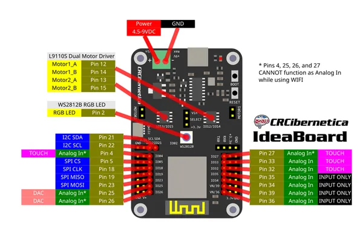

# CRCibernetica IdeaBoard

**CRCibernetica** · ESP32 original

Revision: Not identified  
Coverage: Pinout image collected

[Browse all manufacturers](../../../../BROWSE.md) · [Desktop app](https://github.com/valleytechsolutions/black-wire-desktop)

## Physical board pinout

**pinout image** · Reviewed source · PNG

[Open original reference](../../../../library/media/3257bed0db1f5521ca4d3ce80f1383e05eca7c8b3dbe63502335fc702a5e5801.png)

**Credit and rights:** Not established; source attribution retained. Source/manufacturer: CRCibernetica.

[Source 1](https://cdn11.bigcommerce.com/s-64749/images/stencil/1280x1280/products/2013/9107/pinout__94644.1776573794.png?c=2) · [Source 2](https://www.crcibernetica.com/crcibernetica-ideaboard/)

Discovered from CircuitPython board metadata and the linked product/documentation page. Exact hardware revision requires matching to the diagram.

SHA-256: `3257bed0db1f5521ca4d3ce80f1383e05eca7c8b3dbe63502335fc702a5e5801`

Pin assignments have not been independently electrically verified. Check board revision before wiring.
