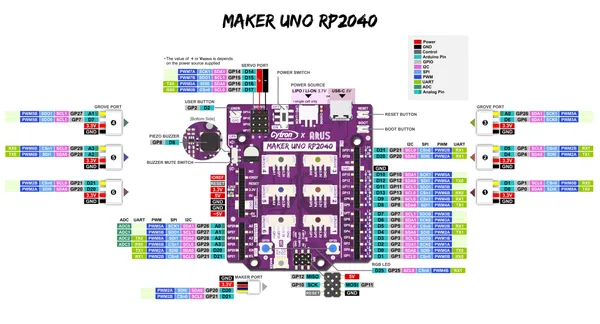

# Maker UNO RP2040

**Cytron Technologies** · RP2040

Revision: Not identified  
Coverage: Pinout image collected

[Browse all manufacturers](../../../../BROWSE.md) · [Desktop app](https://github.com/valleytechsolutions/black-wire-desktop)

## Manufacturer board pinout

**pinout image** · Reviewed source · PNG

[Open original reference](../../../../library/media/22488e9c8b34e87132c2fc4baec57e083c26d55e9df98355d5dd30e64cdc1d63.png)

**Credit and rights:** Not established; source attribution retained. Source/manufacturer: Cytron Technologies.

[Source 1](https://raw.githubusercontent.com/CytronTechnologies/Cytron-MAKER-UNO-RP2040/8af0c9de58681f3ad5e1e4c3a3c8b01cd3d524c1/Images/MAKER-UNO-RP2040-pinout-diagram.png) · [Source 2](https://github.com/CytronTechnologies/Cytron-MAKER-UNO-RP2040/blob/8af0c9de58681f3ad5e1e4c3a3c8b01cd3d524c1/Images/MAKER-UNO-RP2040-pinout-diagram.png)

SHA-256: `22488e9c8b34e87132c2fc4baec57e083c26d55e9df98355d5dd30e64cdc1d63`

Pin assignments have not been independently electrically verified. Check board revision before wiring.
