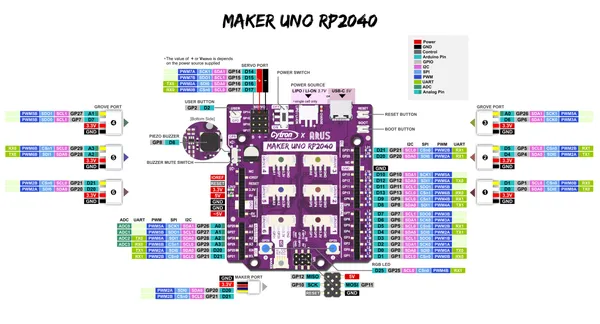

# Maker UNO RP2040

**Cytron Technologies** · RP2040

Revision: Not identified

Coverage: Pinout image collected

[Browse all manufacturers](../../../../BROWSE.md) · [Devices & IoT](../../../../DEVICES.md) · [Open in the browser guide](https://valleytech-black-wire-guide.pages.dev/?board=cytron-technologies-rp2040-maker-uno-rp2040)

## Datasheets and original documentation

Board datasheet: **not yet recorded**. Visual reference: **available**.

[Manufacturer source (recorded link)](https://my.cytron.io/p-maker-uno-rp2040)

A chip datasheet, schematic and board datasheet have different scopes. Match the exact hardware revision.

[Documentation coverage and remaining gaps](../../../../DOCUMENTATION.md)

## Manufacturer board pinout

**pinout image** · Reviewed source · PNG

[Open original reference](../../../../library/media/22488e9c8b34e87132c2fc4baec57e083c26d55e9df98355d5dd30e64cdc1d63.png)

**Credit and rights:** Not established; source attribution retained. Source/manufacturer: Cytron Technologies.

[Source 1](https://raw.githubusercontent.com/CytronTechnologies/Cytron-MAKER-UNO-RP2040/8af0c9de58681f3ad5e1e4c3a3c8b01cd3d524c1/Images/MAKER-UNO-RP2040-pinout-diagram.png) · [Source 2](https://github.com/CytronTechnologies/Cytron-MAKER-UNO-RP2040/blob/8af0c9de58681f3ad5e1e4c3a3c8b01cd3d524c1/Images/MAKER-UNO-RP2040-pinout-diagram.png)

Image revision: Not identified

SHA-256: `22488e9c8b34e87132c2fc4baec57e083c26d55e9df98355d5dd30e64cdc1d63`

Pin assignments have not been independently electrically verified. Check board revision before wiring.
