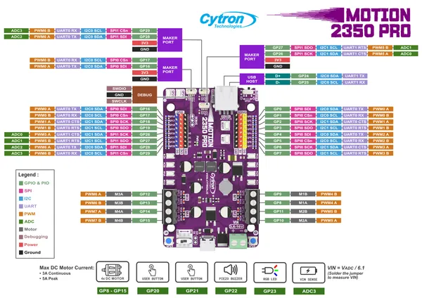

# Motion 2350 Pro

**Cytron Technologies** · RP2350

Revision: Not identified  
Coverage: Pinout image collected

[Browse all manufacturers](../../../../BROWSE.md) · [Desktop app](https://github.com/valleytechsolutions/black-wire-desktop)

## Manufacturer board pinout

**pinout image** · Reviewed source · PNG

[Open original reference](../../../../library/media/34a865c41d2734616960a6a241248eabe3bbf67d8020a5baec2ec2ba53089416.png)

**Credit and rights:** Not established; source attribution retained. Source/manufacturer: Cytron Technologies.

[Source 1](https://raw.githubusercontent.com/CytronTechnologies/Cytron-MOTION-2350-PRO/46996400595d917670a9a6a31cfa07c2297f39c1/images/Pinout_Diagram_MOTION-2350-Pro.png) · [Source 2](https://github.com/CytronTechnologies/Cytron-MOTION-2350-PRO/blob/46996400595d917670a9a6a31cfa07c2297f39c1/images/Pinout_Diagram_MOTION-2350-Pro.png)

SHA-256: `34a865c41d2734616960a6a241248eabe3bbf67d8020a5baec2ec2ba53089416`

Pin assignments have not been independently electrically verified. Check board revision before wiring.
