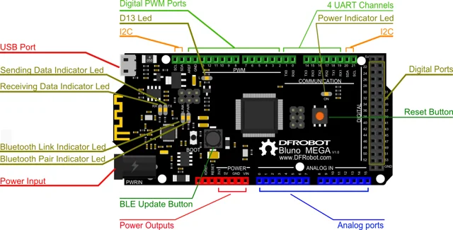

# Bluno Mega2560 / DFR0323

**DFRobot** · ATmega2560

Revision: Not identified

Coverage: Physical pinout reference; independent completeness review pending

[Browse all manufacturers](../../../../BROWSE.md) · [Devices & IoT](../../../../DEVICES.md) · [Open in the browser guide](https://valleytech-black-wire-guide.pages.dev/?board=dfrobot-dfr0323)

Architecture: **AVR**

## Datasheets and original documentation

Board datasheet: **not yet recorded**. Visual reference: **available**.

[Original manufacturer product documentation](https://wiki.dfrobot.com/dfr0323/)

- **hardware-guide / board**: [Model specifications and hardware reference](https://wiki.dfrobot.com/dfr0323/) · online
- **schematic / board**: [Schematics](https://dfimg.dfrobot.com/wiki/17638/DFR0323_bluno-mega2560_schematics_V1.0.pdf) · [saved document](../../../../library/media/fdf169703105a25a9f83f1e7e72224b3dd4e22c0599ec8e393dda90bd369bf55.pdf)
- **component-datasheet / component**: [Component datasheet (not a board datasheet)](https://dfimg.dfrobot.com/wiki/17638/DFR0323_bluno-mega2560_datasheet_V1.0.pdf) · online

Original source reviewed for model and visual type. Pin assignments and electrical limits have not been independently verified. Match the PCB revision before wiring.

[Documentation coverage and remaining gaps](../../../../DOCUMENTATION.md)

## Specifications and hardware documentation

- [Original model specifications](https://wiki.dfrobot.com/dfr0323/)

## Bluno Mega2560 — Pinout

**pinout image** · Reviewed source · WEBP

[Open original reference](../../../../library/media/95081ce19f792bfc9e468805968b688579b5e5af44430ab0c33d61a430f0a061.webp)

**Credit and rights:** DFRobot / original artwork contributors. Asset-specific redistribution and print rights are not established. Black Wire's editorial license does not relicense this artwork.. Source/manufacturer: DFRobot.

[Source 1](https://dfimg.dfrobot.com/nobody/wiki/3f9948a10fd33534b32943f67fd42669_0x0.png.webp) · [Source 2](https://wiki.dfrobot.com/dfr0323/)

Original source reviewed for model and visual type. Pin assignments and electrical limits have not been independently verified. Match the PCB revision before wiring.

Image revision: Not identified

SHA-256: `95081ce19f792bfc9e468805968b688579b5e5af44430ab0c33d61a430f0a061`

## Schematics

**original reference PDF** · Reviewed source · PDF

[Open original reference](../../../../library/media/fdf169703105a25a9f83f1e7e72224b3dd4e22c0599ec8e393dda90bd369bf55.pdf)

**Credit and rights:** DFRobot / original artwork contributors. Asset-specific redistribution and print rights are not established. Black Wire's editorial license does not relicense this artwork.. Source/manufacturer: DFRobot.

[Source 1](https://dfimg.dfrobot.com/wiki/17638/DFR0323_bluno-mega2560_schematics_V1.0.pdf) · [Source 2](https://wiki.dfrobot.com/dfr0323/)

Original source reviewed for model and visual type. Pin assignments and electrical limits have not been independently verified. Match the PCB revision before wiring.

Image revision: Not identified

SHA-256: `fdf169703105a25a9f83f1e7e72224b3dd4e22c0599ec8e393dda90bd369bf55`

Pin assignments have not been independently electrically verified. Check board revision before wiring.
