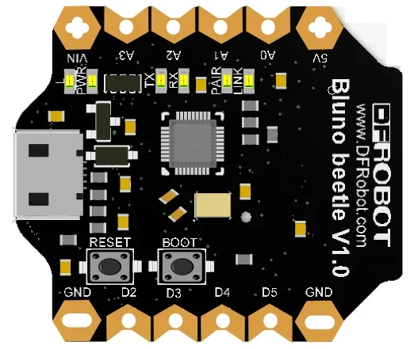
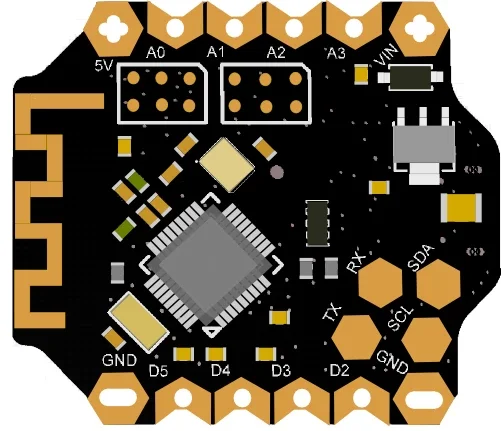

# Beetle BLE Board / DFR0339

**DFRobot** · ATmega328P

Revision: Not identified

Coverage: Supporting documentation; physical pinout still needed

[Browse all manufacturers](../../../../BROWSE.md) · [Devices & IoT](../../../../DEVICES.md) · [Open in the browser guide](https://valleytech-black-wire-guide.pages.dev/?board=dfrobot-dfr0339)

Architecture: **AVR**

## Datasheets and original documentation

Board datasheet: **not yet recorded**. Visual reference: **available**.

[Original manufacturer product documentation](https://wiki.dfrobot.com/dfr0339/)

- **hardware-guide / board**: [Model specifications and hardware reference](https://wiki.dfrobot.com/dfr0339/) · online
- **schematic / board**: [Schematics](https://dfimg.dfrobot.com/wiki/17652/DFR0339_beetle-ble-board_schematics_1.0.pdf) · [saved document](../../../../library/media/581afafd0dced5c283787817002b982da056c78b34788fc8f65100ea0347018e.pdf)

Original source reviewed for model and visual type. Pin assignments and electrical limits have not been independently verified. Match the PCB revision before wiring.

[Documentation coverage and remaining gaps](../../../../DOCUMENTATION.md)

## Specifications and hardware documentation

- [Original model specifications](https://wiki.dfrobot.com/dfr0339/)

## Beetle BLE Board — DFR0339 DFRobot Beetle BLE Pinout Diagram

**board labeling image** · Reviewed source · WEBP

[Open original reference](../../../../library/media/5bbd1ef9d4eb894af576725dc7defb505caa8c64d9c6b42cd24871bbc0487098.webp)

**Credit and rights:** DFRobot / original artwork contributors. Asset-specific redistribution and print rights are not established. Black Wire's editorial license does not relicense this artwork.. Source/manufacturer: DFRobot.

[Source 1](https://dfimg.dfrobot.com/nobody/wiki/a35f06a9dc8215e671d0d5dac083f887_0x0.png.webp) · [Source 2](https://wiki.dfrobot.com/dfr0339/)

Original source reviewed for model and visual type. Pin assignments and electrical limits have not been independently verified. Match the PCB revision before wiring.

Image revision: Not identified

SHA-256: `5bbd1ef9d4eb894af576725dc7defb505caa8c64d9c6b42cd24871bbc0487098`

## Beetle BLE Board — DFR0339 DFRobot Beetle BLE Pinout Diagram

**board labeling image** · Reviewed source · WEBP

[Open original reference](../../../../library/media/93d29bafff99a269f3af7a5b30fd471e29a547225b9ca85cde109bf69cd521de.webp)

**Credit and rights:** DFRobot / original artwork contributors. Asset-specific redistribution and print rights are not established. Black Wire's editorial license does not relicense this artwork.. Source/manufacturer: DFRobot.

[Source 1](https://dfimg.dfrobot.com/nobody/wiki/14d02b457246127341dac5b2b7f5bfac_0x0.png.webp) · [Source 2](https://wiki.dfrobot.com/dfr0339/)

Original source reviewed for model and visual type. Pin assignments and electrical limits have not been independently verified. Match the PCB revision before wiring.

Image revision: Not identified

SHA-256: `93d29bafff99a269f3af7a5b30fd471e29a547225b9ca85cde109bf69cd521de`

## Schematics

**original reference PDF** · Reviewed source · PDF

[Open original reference](../../../../library/media/581afafd0dced5c283787817002b982da056c78b34788fc8f65100ea0347018e.pdf)

**Credit and rights:** DFRobot / original artwork contributors. Asset-specific redistribution and print rights are not established. Black Wire's editorial license does not relicense this artwork.. Source/manufacturer: DFRobot.

[Source 1](https://dfimg.dfrobot.com/wiki/17652/DFR0339_beetle-ble-board_schematics_1.0.pdf) · [Source 2](https://wiki.dfrobot.com/dfr0339/)

Original source reviewed for model and visual type. Pin assignments and electrical limits have not been independently verified. Match the PCB revision before wiring.

Image revision: Not identified

SHA-256: `581afafd0dced5c283787817002b982da056c78b34788fc8f65100ea0347018e`

Pin assignments have not been independently electrically verified. Check board revision before wiring.
