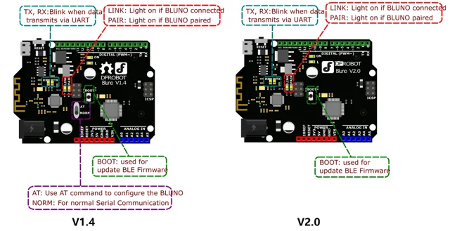

# Bluno - An Arduino UNO Compatible Bluetooth 4.0 (BLE) Controller / DFR0267

**DFRobot** · ATmega328P

Revision: Not identified

Coverage: Supporting documentation; physical pinout still needed

[Browse all manufacturers](../../../../BROWSE.md) · [Devices & IoT](../../../../DEVICES.md) · [Open in the browser guide](https://valleytech-black-wire-guide.pages.dev/?board=dfrobot-dfr0267)

Architecture: **AVR**

## Datasheets and original documentation

Board datasheet: **not yet recorded**. Visual reference: **available**.

[Original manufacturer product documentation](https://wiki.dfrobot.com/dfr0267/)

- **hardware-guide / board**: [Model specifications and hardware reference](https://wiki.dfrobot.com/dfr0267/) · online
- **schematic / board**: [Schematics](https://dfimg.dfrobot.com/wiki/21787/DFR0267_bluno_schematics_V1.0.pdf) · [saved document](../../../../library/media/f3996dfa05fefb4904907709b75ddebc6ffe919027032cda3f385a91a22c647a.pdf)

Original source reviewed for model and visual type. Pin assignments and electrical limits have not been independently verified. Match the PCB revision before wiring.

[Documentation coverage and remaining gaps](../../../../DOCUMENTATION.md)

## Specifications and hardware documentation

- [Original model specifications](https://wiki.dfrobot.com/dfr0267/)

## Bluno - An Arduino UNO Compatible Bluetooth 4.0 (BLE) Controller — Pinout

**board labeling image** · Reviewed source · WEBP

[Open original reference](../../../../library/media/072c6e0515535e02ed965cc55c47286bbe7695dde5bff89509543faf65d74349.webp)

**Credit and rights:** DFRobot / original artwork contributors. Asset-specific redistribution and print rights are not established. Black Wire's editorial license does not relicense this artwork.. Source/manufacturer: DFRobot.

[Source 1](https://dfimg.dfrobot.com/nobody/wiki/fb95bda1d5217392a72a5b8690f5f09c_0x0.png.webp) · [Source 2](https://wiki.dfrobot.com/dfr0267/)

Original source reviewed for model and visual type. Pin assignments and electrical limits have not been independently verified. Match the PCB revision before wiring.

Image revision: Not identified

SHA-256: `072c6e0515535e02ed965cc55c47286bbe7695dde5bff89509543faf65d74349`

## Schematics

**original reference PDF** · Reviewed source · PDF

[Open original reference](../../../../library/media/f3996dfa05fefb4904907709b75ddebc6ffe919027032cda3f385a91a22c647a.pdf)

**Credit and rights:** DFRobot / original artwork contributors. Asset-specific redistribution and print rights are not established. Black Wire's editorial license does not relicense this artwork.. Source/manufacturer: DFRobot.

[Source 1](https://dfimg.dfrobot.com/wiki/21787/DFR0267_bluno_schematics_V1.0.pdf) · [Source 2](https://wiki.dfrobot.com/dfr0267/)

Original source reviewed for model and visual type. Pin assignments and electrical limits have not been independently verified. Match the PCB revision before wiring.

Image revision: Not identified

SHA-256: `f3996dfa05fefb4904907709b75ddebc6ffe919027032cda3f385a91a22c647a`

Pin assignments have not been independently electrically verified. Check board revision before wiring.
