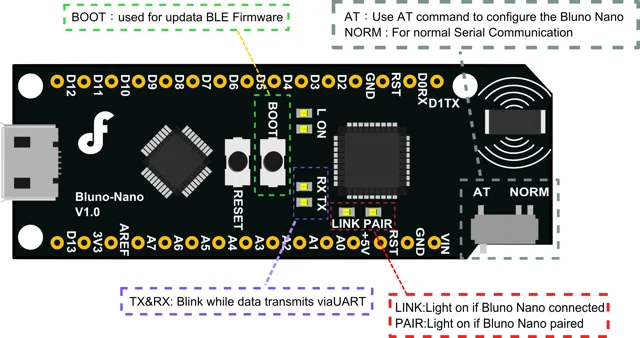

# Bluno Nano / DFR0296

**DFRobot** · ATmega328P

Revision: Not identified

Coverage: Physical pinout reference; independent completeness review pending

[Browse all manufacturers](../../../../BROWSE.md) · [Devices & IoT](../../../../DEVICES.md) · [Open in the browser guide](https://valleytech-black-wire-guide.pages.dev/?board=dfrobot-dfr0296)

Architecture: **AVR**

## Datasheets and original documentation

Board datasheet: **not yet recorded**. Visual reference: **available**.

[Original manufacturer product documentation](https://wiki.dfrobot.com/dfr0296/)

- **hardware-guide / board**: [Model specifications and hardware reference](https://wiki.dfrobot.com/dfr0296/) · online
- **schematic / board**: [Schematics](https://dfimg.dfrobot.com/wiki/17581/DFR0296_bluno-nano_schematics_V1.0.pdf) · [saved document](../../../../library/media/45b8f9ddc4204d9ed24087af34afcc7696389799b7a6d91e168a3f6f6294df76.pdf)

Original source reviewed for model and visual type. Pin assignments and electrical limits have not been independently verified. Match the PCB revision before wiring.

[Documentation coverage and remaining gaps](../../../../DOCUMENTATION.md)

## Specifications and hardware documentation

- [Original model specifications](https://wiki.dfrobot.com/dfr0296/)

## Bluno Nano — Pinout

**pinout image** · Reviewed source · WEBP

[Open original reference](../../../../library/media/b80e3a3e0ef52b714f56ae64819d61f2eceb4c19d99181aac3168630c1fd6a66.webp)

**Credit and rights:** DFRobot / original artwork contributors. Asset-specific redistribution and print rights are not established. Black Wire's editorial license does not relicense this artwork.. Source/manufacturer: DFRobot.

[Source 1](https://dfimg.dfrobot.com/nobody/wiki/f9349ac055104072e6aa2ccbe98f3d23_0x0.png.webp) · [Source 2](https://wiki.dfrobot.com/dfr0296/)

Original source reviewed for model and visual type. Pin assignments and electrical limits have not been independently verified. Match the PCB revision before wiring.

Image revision: Not identified

SHA-256: `b80e3a3e0ef52b714f56ae64819d61f2eceb4c19d99181aac3168630c1fd6a66`

## Schematics

**original reference PDF** · Reviewed source · PDF

[Open original reference](../../../../library/media/45b8f9ddc4204d9ed24087af34afcc7696389799b7a6d91e168a3f6f6294df76.pdf)

**Credit and rights:** DFRobot / original artwork contributors. Asset-specific redistribution and print rights are not established. Black Wire's editorial license does not relicense this artwork.. Source/manufacturer: DFRobot.

[Source 1](https://dfimg.dfrobot.com/wiki/17581/DFR0296_bluno-nano_schematics_V1.0.pdf) · [Source 2](https://wiki.dfrobot.com/dfr0296/)

Original source reviewed for model and visual type. Pin assignments and electrical limits have not been independently verified. Match the PCB revision before wiring.

Image revision: Not identified

SHA-256: `45b8f9ddc4204d9ed24087af34afcc7696389799b7a6d91e168a3f6f6294df76`

Pin assignments have not been independently electrically verified. Check board revision before wiring.
