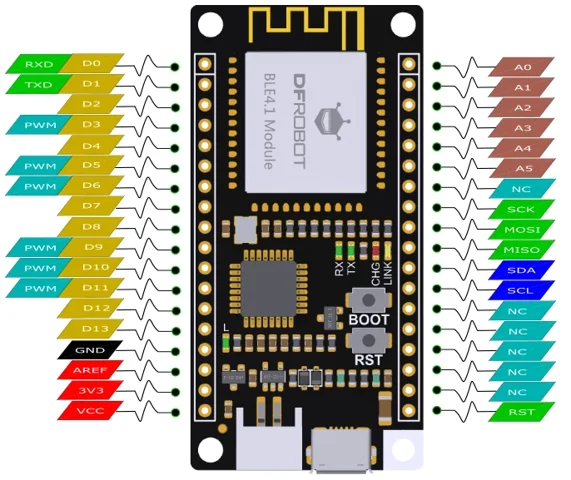

# FireBeetle ATMEGA328P BLE 4.1 Control Board / DFR0492

**DFRobot** · ATmega328P

Revision: Not identified

Coverage: Physical pinout reference; independent completeness review pending

[Browse all manufacturers](../../../../BROWSE.md) · [Devices & IoT](../../../../DEVICES.md) · [Open in the browser guide](https://valleytech-black-wire-guide.pages.dev/?board=dfrobot-dfr0492)

Architecture: **AVR**

## Datasheets and original documentation

Board datasheet: **not yet recorded**. Visual reference: **available**.

[Original manufacturer product documentation](https://wiki.dfrobot.com/dfr0492/)

- **hardware-guide / board**: [Model specifications and hardware reference](https://wiki.dfrobot.com/dfr0492/) · online
- **component-datasheet / component**: [Component datasheet (not a board datasheet)](https://dfimg.dfrobot.com/wiki/21098/DFR0492_fireebeetle-ble4-1-board_datasheet_v1.0.pdf) · online

Original source reviewed for model and visual type. Pin assignments and electrical limits have not been independently verified. Match the PCB revision before wiring.

[Documentation coverage and remaining gaps](../../../../DOCUMENTATION.md)

## Specifications and hardware documentation

- [Original model specifications](https://wiki.dfrobot.com/dfr0492/)

## FireBeetle ATMEGA328P BLE 4.1 Control Board — DFR0492-Pinout

**pinout image** · Reviewed source · WEBP

[Open original reference](../../../../library/media/aec1278fb09ecf1a0f8537e2e95d05c47e8de58e6606170d779a4b3cdef6c604.webp)

**Credit and rights:** DFRobot / original artwork contributors. Asset-specific redistribution and print rights are not established. Black Wire's editorial license does not relicense this artwork.. Source/manufacturer: DFRobot.

[Source 1](https://dfimg.dfrobot.com/62fba4cb025a892c98c6da64/wikien/9f5198cc913a006fcdcfe0698146f24e_0x0.png.webp) · [Source 2](https://wiki.dfrobot.com/dfr0492/)

Original source reviewed for model and visual type. Pin assignments and electrical limits have not been independently verified. Match the PCB revision before wiring.

Image revision: Not identified

SHA-256: `aec1278fb09ecf1a0f8537e2e95d05c47e8de58e6606170d779a4b3cdef6c604`

Pin assignments have not been independently electrically verified. Check board revision before wiring.
