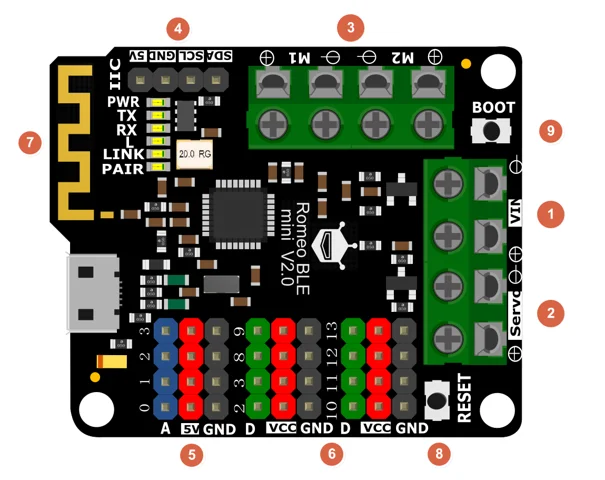

# Romeo ATmega328P BLE Motor Control Board / DFR0351

**DFRobot** · ATmega328P

Revision: Not identified

Coverage: Pinout search pending

[Browse all manufacturers](../../../../BROWSE.md) · [Devices & IoT](../../../../DEVICES.md) · [Open in the browser guide](https://valleytech-black-wire-guide.pages.dev/?board=dfrobot-dfr0351)

Architecture: **AVR**

## Datasheets and original documentation

Board datasheet: **not yet recorded**. Visual reference: **available**.

[Original manufacturer product documentation](https://wiki.dfrobot.com/dfr0351/)

- **hardware-guide / board**: [Model specifications and hardware reference](https://wiki.dfrobot.com/dfr0351/) · online

Original source reviewed for model and visual type. Pin assignments and electrical limits have not been independently verified. Match the PCB revision before wiring.

[Documentation coverage and remaining gaps](../../../../DOCUMENTATION.md)

## Specifications and hardware documentation

- [Original model specifications](https://wiki.dfrobot.com/dfr0351/)

## Romeo BLE Mini V2.0 connector groups and board labels

**board labeling image** · Reviewed source · PNG

[Open original reference](../../../../library/media/86d06baeb7fa36b32a6614fa76684b7c1c6c4f6e3a97f44b399546ad7589813a.png)

**Credit and rights:** DFRobot artwork; redistribution and print rights not established; not relicensed by Black Wire.. Source/manufacturer: DFRobot.

[Source 1](https://dfimg.dfrobot.com/nobody/wiki/0d800b74399e6e8756462b91cd1c7c09.png) · [Source 2](https://wiki.dfrobot.com/dfr0351/)

Original labeled board overview; numbered group callouts require the source table. Not independently electrically verified.

Image revision: V2.0

SHA-256: `86d06baeb7fa36b32a6614fa76684b7c1c6c4f6e3a97f44b399546ad7589813a`

Pin assignments have not been independently electrically verified. Check board revision before wiring.
