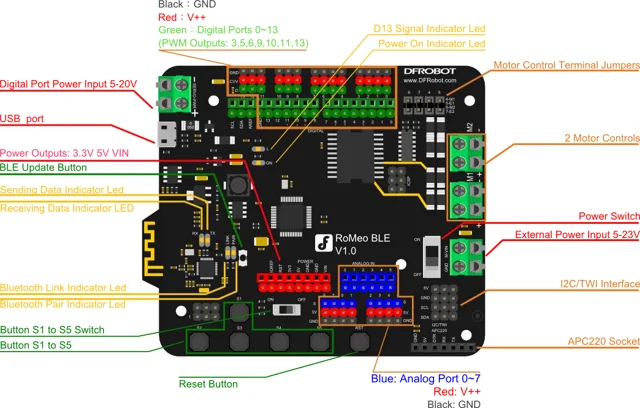

# Romeo BLE Robot Control Board / DFR0305

**DFRobot** · ATmega328P

Revision: Not identified

Coverage: Physical pinout reference; independent completeness review pending

[Browse all manufacturers](../../../../BROWSE.md) · [Devices & IoT](../../../../DEVICES.md) · [Open in the browser guide](https://valleytech-black-wire-guide.pages.dev/?board=dfrobot-dfr0305)

Architecture: **AVR**

## Datasheets and original documentation

Board datasheet: **not yet recorded**. Visual reference: **available**.

[Original manufacturer product documentation](https://wiki.dfrobot.com/dfr0305/)

- **hardware-guide / board**: [Model specifications and hardware reference](https://wiki.dfrobot.com/dfr0305/) · online
- **schematic / board**: [Schematics](https://dfimg.dfrobot.com/wiki/20562/DFR0305_romeo-ble_schematics_V1.0.pdf) · [saved document](../../../../library/media/b5f621621b21bf58411a3e142df55639473ae2b5d06ce7900d6416916cbd58d5.pdf)

Original source reviewed for model and visual type. Pin assignments and electrical limits have not been independently verified. Match the PCB revision before wiring.

[Documentation coverage and remaining gaps](../../../../DOCUMENTATION.md)

## Specifications and hardware documentation

- [Original model specifications](https://wiki.dfrobot.com/dfr0305/)

## Romeo BLE Robot Control Board — Figure 1 Romeo BLE Pin Out

**pinout image** · Reviewed source · WEBP

[Open original reference](../../../../library/media/b3ba884b64236e478f0504245bcfae54705032a80dab591abb2feb4fa73e24ba.webp)

**Credit and rights:** DFRobot / original artwork contributors. Asset-specific redistribution and print rights are not established. Black Wire's editorial license does not relicense this artwork.. Source/manufacturer: DFRobot.

[Source 1](https://dfimg.dfrobot.com/nobody/wiki/30ddc7d82de30d09fd0c2e23640eba1c_0x0.png.webp) · [Source 2](https://wiki.dfrobot.com/dfr0305/)

Original source reviewed for model and visual type. Pin assignments and electrical limits have not been independently verified. Match the PCB revision before wiring.

Image revision: Not identified

SHA-256: `b3ba884b64236e478f0504245bcfae54705032a80dab591abb2feb4fa73e24ba`

## Schematics

**original reference PDF** · Reviewed source · PDF

[Open original reference](../../../../library/media/b5f621621b21bf58411a3e142df55639473ae2b5d06ce7900d6416916cbd58d5.pdf)

**Credit and rights:** DFRobot / original artwork contributors. Asset-specific redistribution and print rights are not established. Black Wire's editorial license does not relicense this artwork.. Source/manufacturer: DFRobot.

[Source 1](https://dfimg.dfrobot.com/wiki/20562/DFR0305_romeo-ble_schematics_V1.0.pdf) · [Source 2](https://wiki.dfrobot.com/dfr0305/)

Original source reviewed for model and visual type. Pin assignments and electrical limits have not been independently verified. Match the PCB revision before wiring.

Image revision: Not identified

SHA-256: `b5f621621b21bf58411a3e142df55639473ae2b5d06ce7900d6416916cbd58d5`

Pin assignments have not been independently electrically verified. Check board revision before wiring.
