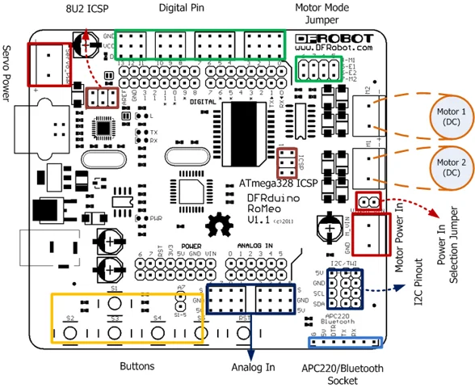

# Romeo Robot Control Board / DFR0004

**DFRobot** · ATmega328P

Revision: Not identified

Coverage: Supporting documentation; physical pinout still needed

[Browse all manufacturers](../../../../BROWSE.md) · [Devices & IoT](../../../../DEVICES.md) · [Open in the browser guide](https://valleytech-black-wire-guide.pages.dev/?board=dfrobot-dfr0004)

Architecture: **AVR**

## Datasheets and original documentation

Board datasheet: **not yet recorded**. Visual reference: **available**.

[Original manufacturer product documentation](https://wiki.dfrobot.com/dfr0004/)

- **hardware-guide / board**: [Model specifications and hardware reference](https://wiki.dfrobot.com/dfr0004/) · online

Original source reviewed for model and visual type. Pin assignments and electrical limits have not been independently verified. Match the PCB revision before wiring.

[Documentation coverage and remaining gaps](../../../../DOCUMENTATION.md)

## Specifications and hardware documentation

- [Original model specifications](https://wiki.dfrobot.com/dfr0004/)

## Romeo Robot Control Board — Fig1: Romeo Pin Out

**board labeling image** · Reviewed source · PNG

[Open original reference](../../../../library/media/1ff06a5488b9abaefba7d21db839ade59f73acaa0eff0b72f674a4430303c1c5.png)

**Credit and rights:** DFRobot / original artwork contributors. Asset-specific redistribution and print rights are not established. Black Wire's editorial license does not relicense this artwork.. Source/manufacturer: DFRobot.

[Source 1](https://raw.githubusercontent.com/DFRobot/DFRobotMediaWikiImage/master/Image/Romeo_v1.1_pinout_Diagram.png) · [Source 2](https://wiki.dfrobot.com/dfr0004/)

Original source reviewed for model and visual type. Pin assignments and electrical limits have not been independently verified. Match the PCB revision before wiring.

Image revision: Not identified

SHA-256: `1ff06a5488b9abaefba7d21db839ade59f73acaa0eff0b72f674a4430303c1c5`

Pin assignments have not been independently electrically verified. Check board revision before wiring.
