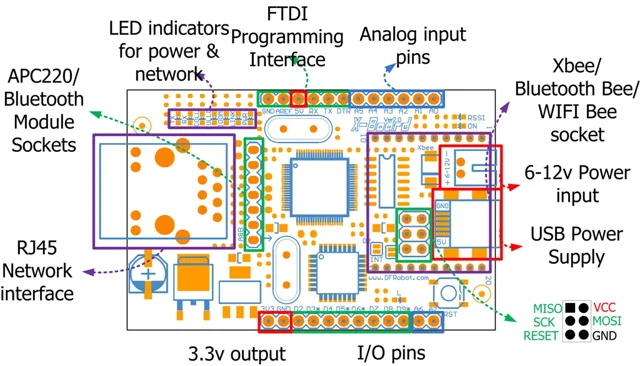

# XBoard V2 / DFR0162

**DFRobot** · ATmega328P

Revision: Not identified

Coverage: Supporting documentation; physical pinout still needed

[Browse all manufacturers](../../../../BROWSE.md) · [Devices & IoT](../../../../DEVICES.md) · [Open in the browser guide](https://valleytech-black-wire-guide.pages.dev/?board=dfrobot-dfr0162)

Architecture: **AVR**

## Datasheets and original documentation

Board datasheet: **not yet recorded**. Visual reference: **available**.

[Original manufacturer product documentation](https://wiki.dfrobot.com/dfr0162/)

- **hardware-guide / board**: [Model specifications and hardware reference](https://wiki.dfrobot.com/dfr0162/) · online
- **schematic / board**: [Schematics](https://dfimg.dfrobot.com/wiki/19347/DFR0162_xboard-v2_schematics_V1.0.pdf) · [saved document](../../../../library/media/a0be427b1bf76d14471bc929ae14ea357370a7328f042463dd131935ebaf01b6.pdf)

Original source reviewed for model and visual type. Pin assignments and electrical limits have not been independently verified. Match the PCB revision before wiring.

[Documentation coverage and remaining gaps](../../../../DOCUMENTATION.md)

## Specifications and hardware documentation

- [Original model specifications](https://wiki.dfrobot.com/dfr0162/)

## XBoard V2 — Xboard v2 pinout

**board labeling image** · Reviewed source · WEBP

[Open original reference](../../../../library/media/12ba0f5458470ce0c66ca09f9b0369282f9a125be6597d2454420a45b981a39e.webp)

**Credit and rights:** DFRobot / original artwork contributors. Asset-specific redistribution and print rights are not established. Black Wire's editorial license does not relicense this artwork.. Source/manufacturer: DFRobot.

[Source 1](https://dfimg.dfrobot.com/nobody/wiki/905437889da995c1243427657b15579a_0x0.png.webp) · [Source 2](https://wiki.dfrobot.com/dfr0162/)

Original source reviewed for model and visual type. Pin assignments and electrical limits have not been independently verified. Match the PCB revision before wiring.

Image revision: Not identified

SHA-256: `12ba0f5458470ce0c66ca09f9b0369282f9a125be6597d2454420a45b981a39e`

## Schematics

**original reference PDF** · Reviewed source · PDF

[Open original reference](../../../../library/media/a0be427b1bf76d14471bc929ae14ea357370a7328f042463dd131935ebaf01b6.pdf)

**Credit and rights:** DFRobot / original artwork contributors. Asset-specific redistribution and print rights are not established. Black Wire's editorial license does not relicense this artwork.. Source/manufacturer: DFRobot.

[Source 1](https://dfimg.dfrobot.com/wiki/19347/DFR0162_xboard-v2_schematics_V1.0.pdf) · [Source 2](https://wiki.dfrobot.com/dfr0162/)

Original source reviewed for model and visual type. Pin assignments and electrical limits have not been independently verified. Match the PCB revision before wiring.

Image revision: Not identified

SHA-256: `a0be427b1bf76d14471bc929ae14ea357370a7328f042463dd131935ebaf01b6`

Pin assignments have not been independently electrically verified. Check board revision before wiring.
