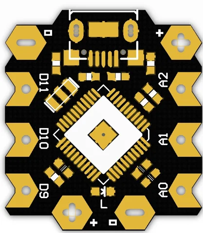
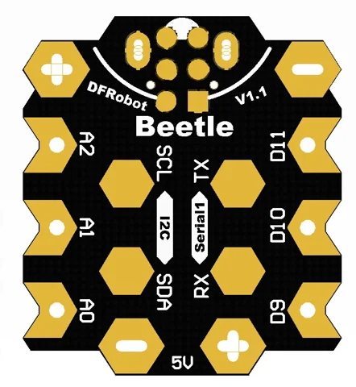

# Beetle ATmega32u4 Arduino-Compatible Board / DFR0282

**DFRobot** · ATmega32U4

Revision: Not identified

Coverage: Supporting documentation; physical pinout still needed

[Browse all manufacturers](../../../../BROWSE.md) · [Devices & IoT](../../../../DEVICES.md) · [Open in the browser guide](https://valleytech-black-wire-guide.pages.dev/?board=dfrobot-dfr0282)

Architecture: **AVR**

## Datasheets and original documentation

Board datasheet: **not yet recorded**. Visual reference: **available**.

[Original manufacturer product documentation](https://wiki.dfrobot.com/dfr0282/)

- **hardware-guide / board**: [Model specifications and hardware reference](https://wiki.dfrobot.com/dfr0282/) · online
- **schematic / board**: [Schematics](https://dfimg.dfrobot.com/wiki/18586/DFR0282_beetle-atmega32u4-arduino-compatible-board_schematics_v1.pdf) · [saved document](../../../../library/media/5abf210a5b2510bb925c63428da9aa34a7eab912cd90dcb80237f0341a815ba5.pdf)

Original source reviewed for model and visual type. Pin assignments and electrical limits have not been independently verified. Match the PCB revision before wiring.

[Documentation coverage and remaining gaps](../../../../DOCUMENTATION.md)

## Specifications and hardware documentation

- [Original model specifications](https://wiki.dfrobot.com/dfr0282/)

## Beetle ATmega32u4 Arduino-Compatible Board — Front View of the Circuit Board

**board labeling image** · Reviewed source · WEBP

[Open original reference](../../../../library/media/c294f2ea4abbb2f0c80f7fe1ad8696aaf58d1d9d198b81aa3489f8060f823246.webp)

**Credit and rights:** DFRobot / original artwork contributors. Asset-specific redistribution and print rights are not established. Black Wire's editorial license does not relicense this artwork.. Source/manufacturer: DFRobot.

[Source 1](https://dfimg.dfrobot.com/5d09937f437c63049d98b469/wiki/36bd54cf08aa89ade2514586b0fb7ae6_0x0.png.webp) · [Source 2](https://wiki.dfrobot.com/dfr0282/)

Original source reviewed for model and visual type. Pin assignments and electrical limits have not been independently verified. Match the PCB revision before wiring.

Image revision: Not identified

SHA-256: `c294f2ea4abbb2f0c80f7fe1ad8696aaf58d1d9d198b81aa3489f8060f823246`

## Beetle ATmega32u4 Arduino-Compatible Board — Front View of the Circuit Board

**board labeling image** · Reviewed source · WEBP

[Open original reference](../../../../library/media/853a46132d15a03c28cc0b9fbecb8883f40cb0c8748811856d7f678befb765df.webp)

**Credit and rights:** DFRobot / original artwork contributors. Asset-specific redistribution and print rights are not established. Black Wire's editorial license does not relicense this artwork.. Source/manufacturer: DFRobot.

[Source 1](https://dfimg.dfrobot.com/5d09937f437c63049d98b469/wiki/657225f47e05a1f923c35c2c58f57528_0x0.png.webp) · [Source 2](https://wiki.dfrobot.com/dfr0282/)

Original source reviewed for model and visual type. Pin assignments and electrical limits have not been independently verified. Match the PCB revision before wiring.

Image revision: Not identified

SHA-256: `853a46132d15a03c28cc0b9fbecb8883f40cb0c8748811856d7f678befb765df`

## Schematics

**original reference PDF** · Reviewed source · PDF

[Open original reference](../../../../library/media/5abf210a5b2510bb925c63428da9aa34a7eab912cd90dcb80237f0341a815ba5.pdf)

**Credit and rights:** DFRobot / original artwork contributors. Asset-specific redistribution and print rights are not established. Black Wire's editorial license does not relicense this artwork.. Source/manufacturer: DFRobot.

[Source 1](https://dfimg.dfrobot.com/wiki/18586/DFR0282_beetle-atmega32u4-arduino-compatible-board_schematics_v1.pdf) · [Source 2](https://wiki.dfrobot.com/dfr0282/)

Original source reviewed for model and visual type. Pin assignments and electrical limits have not been independently verified. Match the PCB revision before wiring.

Image revision: Not identified

SHA-256: `5abf210a5b2510bb925c63428da9aa34a7eab912cd90dcb80237f0341a815ba5`

Pin assignments have not been independently electrically verified. Check board revision before wiring.
