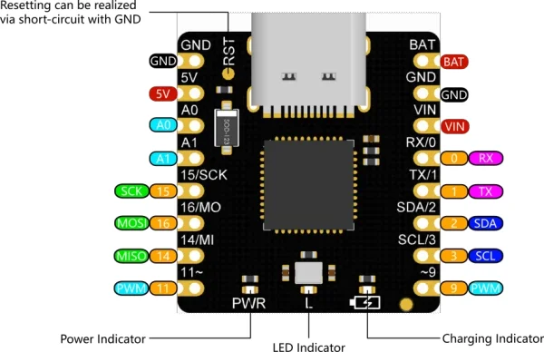

# Beetle ATmega32U4 Charge Management Board / DFR0816

**DFRobot** · ATmega32U4

Revision: Not identified

Coverage: Physical pinout reference; independent completeness review pending

[Browse all manufacturers](../../../../BROWSE.md) · [Devices & IoT](../../../../DEVICES.md) · [Open in the browser guide](https://valleytech-black-wire-guide.pages.dev/?board=dfrobot-dfr0816)

Architecture: **AVR**

## Datasheets and original documentation

Board datasheet: **not yet recorded**. Visual reference: **available**.

[Original manufacturer product documentation](https://wiki.dfrobot.com/dfr0816/)

- **hardware-guide / board**: [Model specifications and hardware reference](https://wiki.dfrobot.com/dfr0816/) · online
- **schematic / board**: [Schematics](https://dfimg.dfrobot.com/wiki/17586/DFR0816_beetle-atmega32u4-charge-management-board_schematics_v1.0.0.pdf) · [saved document](../../../../library/media/112c17ee4af7835d49c4be1716fa9054c23c4fda35858fcdcf6426756aabd0b6.pdf)
- **component-datasheet / component**: [Component datasheet (not a board datasheet)](https://dfimg.dfrobot.com/wiki/17586/DFR0816_beetle-atmega32u4-charge-management-board_datasheet_v1.pdf) · online

Original source reviewed for model and visual type. Pin assignments and electrical limits have not been independently verified. Match the PCB revision before wiring.

[Documentation coverage and remaining gaps](../../../../DOCUMENTATION.md)

## Specifications and hardware documentation

- [Original model specifications](https://wiki.dfrobot.com/dfr0816/)

## Beetle ATmega32U4 Charge Management Board — Beetle ATmega32U4 Charge Management Board pinout

**pinout image** · Reviewed source · WEBP

[Open original reference](../../../../library/media/07ca4ba7e53ba6353666d7625921eed12ddb1517266bd4ef57d8043460df8779.webp)

**Credit and rights:** DFRobot / original artwork contributors. Asset-specific redistribution and print rights are not established. Black Wire's editorial license does not relicense this artwork.. Source/manufacturer: DFRobot.

[Source 1](https://dfimg.dfrobot.com/5d57611a3416442fa39bffca/wiki/1e5ec47f1ab177a8e40fff3d26e216a8_0x0.png.webp) · [Source 2](https://wiki.dfrobot.com/dfr0816/)

Original source reviewed for model and visual type. Pin assignments and electrical limits have not been independently verified. Match the PCB revision before wiring.

Image revision: Not identified

SHA-256: `07ca4ba7e53ba6353666d7625921eed12ddb1517266bd4ef57d8043460df8779`

## Schematics

**original reference PDF** · Reviewed source · PDF

[Open original reference](../../../../library/media/112c17ee4af7835d49c4be1716fa9054c23c4fda35858fcdcf6426756aabd0b6.pdf)

**Credit and rights:** DFRobot / original artwork contributors. Asset-specific redistribution and print rights are not established. Black Wire's editorial license does not relicense this artwork.. Source/manufacturer: DFRobot.

[Source 1](https://dfimg.dfrobot.com/wiki/17586/DFR0816_beetle-atmega32u4-charge-management-board_schematics_v1.0.0.pdf) · [Source 2](https://wiki.dfrobot.com/dfr0816/)

Original source reviewed for model and visual type. Pin assignments and electrical limits have not been independently verified. Match the PCB revision before wiring.

Image revision: Not identified

SHA-256: `112c17ee4af7835d49c4be1716fa9054c23c4fda35858fcdcf6426756aabd0b6`

Pin assignments have not been independently electrically verified. Check board revision before wiring.
