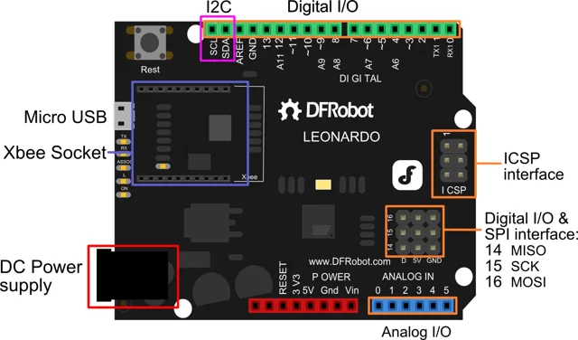

# DFRduino ATmega32u4 Xbee Socket Board / DFR0221

**DFRobot** · ATmega32U4

Revision: Not identified

Coverage: Physical pinout reference; independent completeness review pending

[Browse all manufacturers](../../../../BROWSE.md) · [Devices & IoT](../../../../DEVICES.md) · [Open in the browser guide](https://valleytech-black-wire-guide.pages.dev/?board=dfrobot-dfr0221)

Architecture: **AVR**

## Datasheets and original documentation

Board datasheet: **not yet recorded**. Visual reference: **available**.

[Original manufacturer product documentation](https://wiki.dfrobot.com/dfr0221/)

- **hardware-guide / board**: [Model specifications and hardware reference](https://wiki.dfrobot.com/dfr0221/) · online
- **schematic / board**: [Schematics](https://dfimg.dfrobot.com/wiki/17508/DFR0221_atmega32u4-xbee-socket-board_schematics_v1.1.pdf) · [saved document](../../../../library/media/772bfdc46a2af90a307195068a5f5e92673c2e56cef89e2e928f8e60fe841241.pdf)
- **component-datasheet / component**: [Component datasheet (not a board datasheet)](https://dfimg.dfrobot.com/wiki/17508/DFR0221_atmega32u4-xbee-socket-board_datasheet_v1.pdf) · online

Original source reviewed for model and visual type. Pin assignments and electrical limits have not been independently verified. Match the PCB revision before wiring.

[Documentation coverage and remaining gaps](../../../../DOCUMENTATION.md)

## Specifications and hardware documentation

- [Original model specifications](https://wiki.dfrobot.com/dfr0221/)

## DFRduino ATmega32u4 Xbee Socket Board — DFRduino Leonardo Pin Out

**pinout image** · Reviewed source · WEBP

[Open original reference](../../../../library/media/c9a2f3905a65fe2cb6869724994e95a3b5c25074c87dacb48344ec59b413dec3.webp)

**Credit and rights:** DFRobot / original artwork contributors. Asset-specific redistribution and print rights are not established. Black Wire's editorial license does not relicense this artwork.. Source/manufacturer: DFRobot.

[Source 1](https://dfimg.dfrobot.com/8bb17537945149e4bbdf9d76904713d0/wikien/f246cef6bce82a1eb3780b680475854f_0x0.png.webp) · [Source 2](https://wiki.dfrobot.com/dfr0221/)

Original source reviewed for model and visual type. Pin assignments and electrical limits have not been independently verified. Match the PCB revision before wiring.

Image revision: Not identified

SHA-256: `c9a2f3905a65fe2cb6869724994e95a3b5c25074c87dacb48344ec59b413dec3`

## Schematics

**original reference PDF** · Reviewed source · PDF

[Open original reference](../../../../library/media/772bfdc46a2af90a307195068a5f5e92673c2e56cef89e2e928f8e60fe841241.pdf)

**Credit and rights:** DFRobot / original artwork contributors. Asset-specific redistribution and print rights are not established. Black Wire's editorial license does not relicense this artwork.. Source/manufacturer: DFRobot.

[Source 1](https://dfimg.dfrobot.com/wiki/17508/DFR0221_atmega32u4-xbee-socket-board_schematics_v1.1.pdf) · [Source 2](https://wiki.dfrobot.com/dfr0221/)

Original source reviewed for model and visual type. Pin assignments and electrical limits have not been independently verified. Match the PCB revision before wiring.

Image revision: Not identified

SHA-256: `772bfdc46a2af90a307195068a5f5e92673c2e56cef89e2e928f8e60fe841241`

Pin assignments have not been independently electrically verified. Check board revision before wiring.
