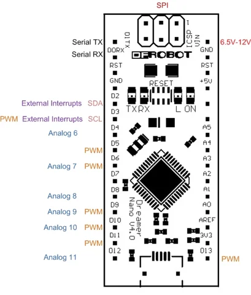

# Dreamer Nano V4.1 (Arduino Leonardo Compatible) / DFR0213

**DFRobot** · ATmega32U4

Revision: Not identified

Coverage: Physical pinout reference; independent completeness review pending

[Browse all manufacturers](../../../../BROWSE.md) · [Devices & IoT](../../../../DEVICES.md) · [Open in the browser guide](https://valleytech-black-wire-guide.pages.dev/?board=dfrobot-dfr0213)

Architecture: **AVR**

## Datasheets and original documentation

Board datasheet: **not yet recorded**. Visual reference: **available**.

[Original manufacturer product documentation](https://wiki.dfrobot.com/dfr0213/)

- **hardware-guide / board**: [Model specifications and hardware reference](https://wiki.dfrobot.com/dfr0213/) · online
- **design-files / board**: [Layout](https://dfimg.dfrobot.com/wiki/17561/DFR0213_atmega32u4-compact-controller-board_layout_v4.0.pdf) · [saved document](../../../../library/media/ef1873ab40e1fd82aa46525dcc60e945abd38d55b1de9343450ac73fa2fd5822.pdf)
- **schematic / board**: [Schematics](https://dfimg.dfrobot.com/wiki/17561/DFR0213_atmega32u4-compact-controller-board_schematics_v4.1.pdf) · [saved document](../../../../library/media/7a51260e61a6ea57b9f8c97882a8c1cc272963f9d10a075bf63d8b5f8eabdf96.pdf)
- **component-datasheet / component**: [Component datasheet (not a board datasheet)](https://dfimg.dfrobot.com/wiki/17561/DFR0213_atmega32u4-compact-controller-board_datasheet_v4.0.pdf) · online

Original source reviewed for model and visual type. Pin assignments and electrical limits have not been independently verified. Match the PCB revision before wiring.

[Documentation coverage and remaining gaps](../../../../DOCUMENTATION.md)

## Specifications and hardware documentation

- [Original model specifications](https://wiki.dfrobot.com/dfr0213/)

## Dreamer Nano V4.1 (Arduino Leonardo Compatible) — pins on the Dreamer Nano board

**pinout image** · Reviewed source · WEBP

[Open original reference](../../../../library/media/4b5e5173c9ff588e03baea342ac531fbc2d0efe65e953a7e32478de889775591.webp)

**Credit and rights:** DFRobot / original artwork contributors. Asset-specific redistribution and print rights are not established. Black Wire's editorial license does not relicense this artwork.. Source/manufacturer: DFRobot.

[Source 1](https://dfimg.dfrobot.com/8bb17537945149e4bbdf9d76904713d0/wikien/13b77cb530e08bed3351f6698e695366_0x0.png.webp) · [Source 2](https://wiki.dfrobot.com/dfr0213/)

Original source reviewed for model and visual type. Pin assignments and electrical limits have not been independently verified. Match the PCB revision before wiring.

Image revision: Not identified

SHA-256: `4b5e5173c9ff588e03baea342ac531fbc2d0efe65e953a7e32478de889775591`

## Layout

**original reference PDF** · Reviewed source · PDF

[Open original reference](../../../../library/media/ef1873ab40e1fd82aa46525dcc60e945abd38d55b1de9343450ac73fa2fd5822.pdf)

**Credit and rights:** DFRobot / original artwork contributors. Asset-specific redistribution and print rights are not established. Black Wire's editorial license does not relicense this artwork.. Source/manufacturer: DFRobot.

[Source 1](https://dfimg.dfrobot.com/wiki/17561/DFR0213_atmega32u4-compact-controller-board_layout_v4.0.pdf) · [Source 2](https://wiki.dfrobot.com/dfr0213/)

Original source reviewed for model and visual type. Pin assignments and electrical limits have not been independently verified. Match the PCB revision before wiring.

Image revision: Not identified

SHA-256: `ef1873ab40e1fd82aa46525dcc60e945abd38d55b1de9343450ac73fa2fd5822`

## Schematics

**original reference PDF** · Reviewed source · PDF

[Open original reference](../../../../library/media/7a51260e61a6ea57b9f8c97882a8c1cc272963f9d10a075bf63d8b5f8eabdf96.pdf)

**Credit and rights:** DFRobot / original artwork contributors. Asset-specific redistribution and print rights are not established. Black Wire's editorial license does not relicense this artwork.. Source/manufacturer: DFRobot.

[Source 1](https://dfimg.dfrobot.com/wiki/17561/DFR0213_atmega32u4-compact-controller-board_schematics_v4.1.pdf) · [Source 2](https://wiki.dfrobot.com/dfr0213/)

Original source reviewed for model and visual type. Pin assignments and electrical limits have not been independently verified. Match the PCB revision before wiring.

Image revision: Not identified

SHA-256: `7a51260e61a6ea57b9f8c97882a8c1cc272963f9d10a075bf63d8b5f8eabdf96`

Pin assignments have not been independently electrically verified. Check board revision before wiring.
