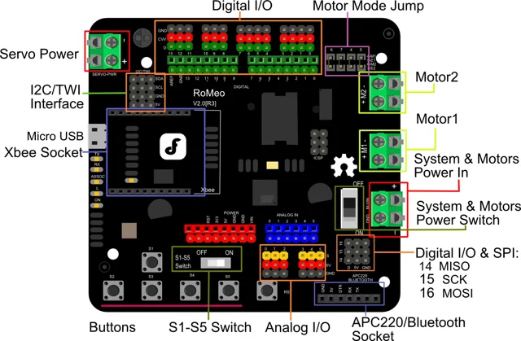

# Romeo V2 ATmega32u4 All-in-One Robotics Microcontroller Board / DFR0225

**DFRobot** · ATmega32U4

Revision: Not identified

Coverage: Physical pinout reference; independent completeness review pending

[Browse all manufacturers](../../../../BROWSE.md) · [Devices & IoT](../../../../DEVICES.md) · [Open in the browser guide](https://valleytech-black-wire-guide.pages.dev/?board=dfrobot-dfr0225)

Architecture: **AVR**

## Datasheets and original documentation

Board datasheet: **not yet recorded**. Visual reference: **available**.

[Original manufacturer product documentation](https://wiki.dfrobot.com/dfr0225/)

- **hardware-guide / board**: [Model specifications and hardware reference](https://wiki.dfrobot.com/dfr0225/) · online
- **schematic / board**: [Schematics](https://dfimg.dfrobot.com/wiki/19382/DFR0225_romeo-atmega32u4-all-in-one-robotics-microcontroller-board_schematics_v2.pdf) · [saved document](../../../../library/media/a98b1212f329a170d802a00074b902205c149a3e8a44eab9f3660ab4fd749b7d.pdf)

Original source reviewed for model and visual type. Pin assignments and electrical limits have not been independently verified. Match the PCB revision before wiring.

[Documentation coverage and remaining gaps](../../../../DOCUMENTATION.md)

## Specifications and hardware documentation

- [Original model specifications](https://wiki.dfrobot.com/dfr0225/)

## Romeo V2 ATmega32u4 All-in-One Robotics Microcontroller Board — Romeo v2 pinout

**pinout image** · Reviewed source · WEBP

[Open original reference](../../../../library/media/6e15794996be245fd3b3c1a5f27f4b9b106d77ea7ea1826bfac2c9730df4ccc4.webp)

**Credit and rights:** DFRobot / original artwork contributors. Asset-specific redistribution and print rights are not established. Black Wire's editorial license does not relicense this artwork.. Source/manufacturer: DFRobot.

[Source 1](https://dfimg.dfrobot.com/8bb17537945149e4bbdf9d76904713d0/wikien/fb0c1a3ed218564d29486c57e59017a0_0x0.png.webp) · [Source 2](https://wiki.dfrobot.com/dfr0225/)

Original source reviewed for model and visual type. Pin assignments and electrical limits have not been independently verified. Match the PCB revision before wiring.

Image revision: Not identified

SHA-256: `6e15794996be245fd3b3c1a5f27f4b9b106d77ea7ea1826bfac2c9730df4ccc4`

## Schematics

**original reference PDF** · Reviewed source · PDF

[Open original reference](../../../../library/media/a98b1212f329a170d802a00074b902205c149a3e8a44eab9f3660ab4fd749b7d.pdf)

**Credit and rights:** DFRobot / original artwork contributors. Asset-specific redistribution and print rights are not established. Black Wire's editorial license does not relicense this artwork.. Source/manufacturer: DFRobot.

[Source 1](https://dfimg.dfrobot.com/wiki/19382/DFR0225_romeo-atmega32u4-all-in-one-robotics-microcontroller-board_schematics_v2.pdf) · [Source 2](https://wiki.dfrobot.com/dfr0225/)

Original source reviewed for model and visual type. Pin assignments and electrical limits have not been independently verified. Match the PCB revision before wiring.

Image revision: Not identified

SHA-256: `a98b1212f329a170d802a00074b902205c149a3e8a44eab9f3660ab4fd749b7d`

Pin assignments have not been independently electrically verified. Check board revision before wiring.
