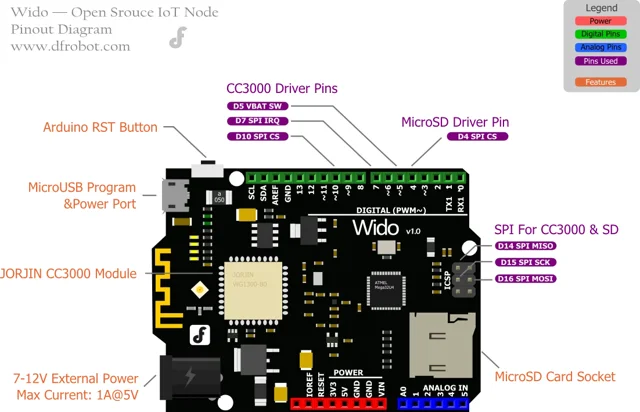

# WIFI IoT Node Development Board / DFR0321

**DFRobot** · ATmega32U4

Revision: Not identified

Coverage: Physical pinout reference; independent completeness review pending

[Browse all manufacturers](../../../../BROWSE.md) · [Devices & IoT](../../../../DEVICES.md) · [Open in the browser guide](https://valleytech-black-wire-guide.pages.dev/?board=dfrobot-dfr0321)

Architecture: **AVR**

## Datasheets and original documentation

Board datasheet: **not yet recorded**. Visual reference: **available**.

[Original manufacturer product documentation](https://wiki.dfrobot.com/dfr0321/)

- **hardware-guide / board**: [Model specifications and hardware reference](https://wiki.dfrobot.com/dfr0321/) · online
- **schematic / board**: [Schematics](https://dfimg.dfrobot.com/wiki/20506/DFR0321_wifi-iot-node-board_schematics_V1.0.pdf) · [saved document](../../../../library/media/d67b756d0376ed532b8e89755be7c47e8a16a85a8c57168ebf1cc2f8264c85e5.pdf)
- **component-datasheet / component**: [Component datasheet (not a board datasheet)](https://dfimg.dfrobot.com/wiki/20506/DFR0321_wifi-iot-node-board_datasheet_V1.0.pdf) · online

Original source reviewed for model and visual type. Pin assignments and electrical limits have not been independently verified. Match the PCB revision before wiring.

[Documentation coverage and remaining gaps](../../../../DOCUMENTATION.md)

## Specifications and hardware documentation

- [Original model specifications](https://wiki.dfrobot.com/dfr0321/)

## WIFI IoT Node Development Board — DFR0321-functional diagram

**pinout image** · Reviewed source · WEBP

[Open original reference](../../../../library/media/522393a0baa6feda63409f79e4ee8d0741b3df04b9c8574f64a5606ade9cc21b.webp)

**Credit and rights:** DFRobot / original artwork contributors. Asset-specific redistribution and print rights are not established. Black Wire's editorial license does not relicense this artwork.. Source/manufacturer: DFRobot.

[Source 1](https://dfimg.dfrobot.com/8116b3fb111c496b92a0efac795320fc/wikien/1f4a2bc6559de8ace960dba3e3e4baec_0x0.png.webp) · [Source 2](https://wiki.dfrobot.com/dfr0321/)

Original source reviewed for model and visual type. Pin assignments and electrical limits have not been independently verified. Match the PCB revision before wiring.

Image revision: Not identified

SHA-256: `522393a0baa6feda63409f79e4ee8d0741b3df04b9c8574f64a5606ade9cc21b`

## Schematics

**original reference PDF** · Reviewed source · PDF

[Open original reference](../../../../library/media/d67b756d0376ed532b8e89755be7c47e8a16a85a8c57168ebf1cc2f8264c85e5.pdf)

**Credit and rights:** DFRobot / original artwork contributors. Asset-specific redistribution and print rights are not established. Black Wire's editorial license does not relicense this artwork.. Source/manufacturer: DFRobot.

[Source 1](https://dfimg.dfrobot.com/wiki/20506/DFR0321_wifi-iot-node-board_schematics_V1.0.pdf) · [Source 2](https://wiki.dfrobot.com/dfr0321/)

Original source reviewed for model and visual type. Pin assignments and electrical limits have not been independently verified. Match the PCB revision before wiring.

Image revision: Not identified

SHA-256: `d67b756d0376ed532b8e89755be7c47e8a16a85a8c57168ebf1cc2f8264c85e5`

Pin assignments have not been independently electrically verified. Check board revision before wiring.
