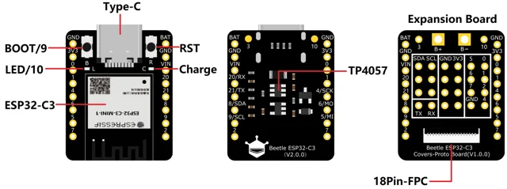
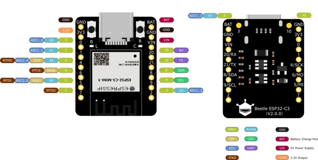

# Beetle ESP32-C3 IoT Development Board / DFR0868

**DFRobot** · ESP32-C3

Revision: Not identified

Coverage: Physical pinout reference; independent completeness review pending

[Browse all manufacturers](../../../../BROWSE.md) · [Devices & IoT](../../../../DEVICES.md) · [Open in the browser guide](https://valleytech-black-wire-guide.pages.dev/?board=dfrobot-esp32-beetle-esp32-c3)

Architecture: **RISC-V**

## Datasheets and original documentation

Board datasheet: **not yet recorded**. Visual reference: **available**.

[Original manufacturer product documentation](https://wiki.dfrobot.com/dfr0868/)

- **hardware-guide / board**: [Model specifications and hardware reference](https://wiki.dfrobot.com/dfr0868/) · online
- **component-datasheet / component**: [Component datasheet (not a board datasheet)](https://dfimg.dfrobot.com/wiki/22768/DFR0868_beetle-esp32-c3_datasheet_V1.0.pdf) · online

Original source reviewed for model and visual type. Pin assignments and electrical limits have not been independently verified. Match the PCB revision before wiring.

[Documentation coverage and remaining gaps](../../../../DOCUMENTATION.md)

## Specifications and hardware documentation

- [Original model specifications](https://wiki.dfrobot.com/dfr0868/)

## Beetle ESP32-C3 IoT Development Board — On-board Function Diagram

**board labeling image** · Reviewed source · WEBP

[Open original reference](../../../../library/media/6ca073ae8eb6eb94f491556339c2fdfe996c6d486924d29b2574f09e736d6d3c.webp)

**Credit and rights:** DFRobot / original artwork contributors. Asset-specific redistribution and print rights are not established. Black Wire's editorial license does not relicense this artwork.. Source/manufacturer: DFRobot.

[Source 1](https://dfimg.dfrobot.com/62d52567aa9508d63a4247a1/wikien/5bc77d2bc2abd67d368e19556c57159b_0x0.png.webp) · [Source 2](https://wiki.dfrobot.com/dfr0868/)

Original source reviewed for model and visual type. Pin assignments and electrical limits have not been independently verified. Match the PCB revision before wiring.

Image revision: Not identified

SHA-256: `6ca073ae8eb6eb94f491556339c2fdfe996c6d486924d29b2574f09e736d6d3c`

## Beetle ESP32-C3 IoT Development Board — Pin Diagram

**pinout image** · Reviewed source · WEBP

[Open original reference](../../../../library/media/37454ef9e938729998415b9cc24c0924d892ae56baa95e0c1d5948a0f058ed2c.webp)

**Credit and rights:** DFRobot / original artwork contributors. Asset-specific redistribution and print rights are not established. Black Wire's editorial license does not relicense this artwork.. Source/manufacturer: DFRobot.

[Source 1](https://dfimg.dfrobot.com/62d52567aa9508d63a4247a1/wikien/6c2681eb251668d546e0269c2792d75e_0x0.png.webp) · [Source 2](https://wiki.dfrobot.com/dfr0868/)

Original source reviewed for model and visual type. Pin assignments and electrical limits have not been independently verified. Match the PCB revision before wiring.

Image revision: Not identified

SHA-256: `37454ef9e938729998415b9cc24c0924d892ae56baa95e0c1d5948a0f058ed2c`

Pin assignments have not been independently electrically verified. Check board revision before wiring.
