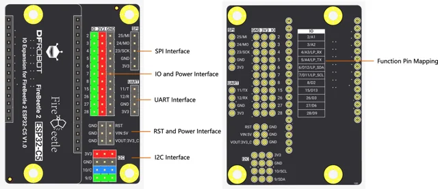
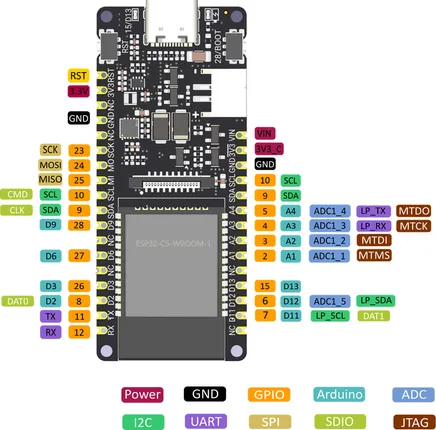

# FireBeetle 2 ESP32-C5 Development Kit / DFR1236

**DFRobot** · ESP32-C5

Revision: Not identified

Coverage: Physical pinout reference; independent completeness review pending

[Browse all manufacturers](../../../../BROWSE.md) · [Devices & IoT](../../../../DEVICES.md) · [Open in the browser guide](https://valleytech-black-wire-guide.pages.dev/?board=dfrobot-dfr1236)

Architecture: **RISC-V**

## Datasheets and original documentation

Board datasheet: **not yet recorded**. Visual reference: **available**.

[Original manufacturer product documentation](https://wiki.dfrobot.com/dfr1236/)

- **hardware-guide / board**: [Model specifications and hardware reference](https://wiki.dfrobot.com/dfr1236/) · online
- **schematic / board**: [Schematics](https://dfimg.dfrobot.com/wiki/20184/DFR1236_firebeetle-2-esp32-c5-kit_schematics_V1.0.pdf) · [saved document](../../../../library/media/f0098cf558e2c2bfae532f342af06e1a547332e00caaa749768eb975041645f1.pdf)

Original source reviewed for model and visual type. Pin assignments and electrical limits have not been independently verified. Match the PCB revision before wiring. The manufacturer reuses the base C5 header map. It does not document every connector on an expansion kit or establish identical antenna hardware.

[Documentation coverage and remaining gaps](../../../../DOCUMENTATION.md)

## Specifications and hardware documentation

- [Original model specifications](https://wiki.dfrobot.com/dfr1236/)

## FireBeetle 2 ESP32-C5 Development Kit — IO expansion board

**board labeling image** · Reviewed source · WEBP

[Open original reference](../../../../library/media/c74508b3315500e52ea97eb0fa03882a146f67822be3e52a5053e637f144dcff.webp)

**Credit and rights:** DFRobot / original artwork contributors. Asset-specific redistribution and print rights are not established. Black Wire's editorial license does not relicense this artwork.. Source/manufacturer: DFRobot.

[Source 1](https://dfimg.dfrobot.com/62d52567aa9508d63a4247a1/wikien/38c4ff383db95c59a74af67bbb8ced25_0x0.png.webp) · [Source 2](https://wiki.dfrobot.com/dfr1236/)

Original source reviewed for model and visual type. Pin assignments and electrical limits have not been independently verified. Match the PCB revision before wiring. The manufacturer reuses the base C5 header map. It does not document every connector on an expansion kit or establish identical antenna hardware.

Image revision: Not identified

SHA-256: `c74508b3315500e52ea97eb0fa03882a146f67822be3e52a5053e637f144dcff`

## Pinout

**pinout image** · Reviewed source · PNG

[Open original reference](../../../../library/media/aef7cedcb5e1247695086e4f6d5d21e365f2893a2fab51d5e5391b6238351c88.png)

**Credit and rights:** Not established; source attribution retained. Source/manufacturer: DFRobot.

[Source 1](https://img.dfrobot.com.cn/wikicn/5d57611a3416442fa39bffca/8cc29ebe8bc5b56082743201bc374c1b.png) · [Source 2](https://wiki.dfrobot.com/dfr1236/)

Original source reviewed for model and visual type. Pin assignments and electrical limits have not been independently verified. Match the PCB revision before wiring. The manufacturer reuses the base C5 header map. It does not document every connector on an expansion kit or establish identical antenna hardware.

Image revision: Not identified

SHA-256: `aef7cedcb5e1247695086e4f6d5d21e365f2893a2fab51d5e5391b6238351c88`

## Schematics

**original reference PDF** · Reviewed source · PDF

[Open original reference](../../../../library/media/f0098cf558e2c2bfae532f342af06e1a547332e00caaa749768eb975041645f1.pdf)

**Credit and rights:** DFRobot / original artwork contributors. Asset-specific redistribution and print rights are not established. Black Wire's editorial license does not relicense this artwork.. Source/manufacturer: DFRobot.

[Source 1](https://dfimg.dfrobot.com/wiki/20184/DFR1236_firebeetle-2-esp32-c5-kit_schematics_V1.0.pdf) · [Source 2](https://wiki.dfrobot.com/dfr1236/)

Original source reviewed for model and visual type. Pin assignments and electrical limits have not been independently verified. Match the PCB revision before wiring. The manufacturer reuses the base C5 header map. It does not document every connector on an expansion kit or establish identical antenna hardware.

Image revision: Not identified

SHA-256: `f0098cf558e2c2bfae532f342af06e1a547332e00caaa749768eb975041645f1`

Pin assignments have not been independently electrically verified. Check board revision before wiring.
