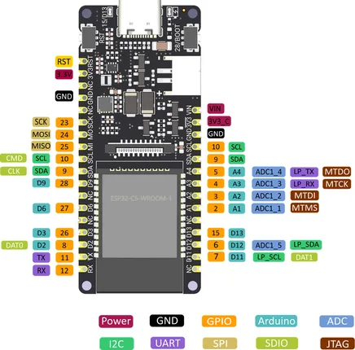

# FireBeetle 2 ESP32-C5 DFR1222

**DFRobot** · ESP32-C5

Revision: Not identified  
Coverage: Pinout image collected

[Browse all manufacturers](../../../../BROWSE.md) · [Desktop app](https://github.com/valleytechsolutions/black-wire-desktop)

## Pinout

**pinout image** · Reviewed source · PNG

[Open original reference](../../../../library/media/aef7cedcb5e1247695086e4f6d5d21e365f2893a2fab51d5e5391b6238351c88.png)

**Credit and rights:** Not established; source attribution retained. Source/manufacturer: DFRobot.

[Source 1](https://img.dfrobot.com.cn/wikicn/5d57611a3416442fa39bffca/8cc29ebe8bc5b56082743201bc374c1b.png) · [Source 2](https://wiki.dfrobot.com/SKU_DFR1222_Firebeetle_2_ESP32_C5_Development_Board)

SHA-256: `aef7cedcb5e1247695086e4f6d5d21e365f2893a2fab51d5e5391b6238351c88`

Pin assignments have not been independently electrically verified. Check board revision before wiring.
