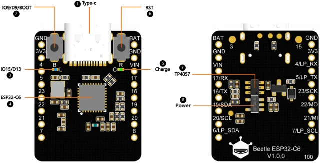
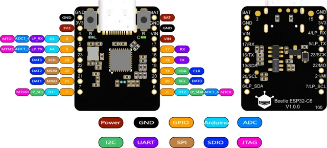

# Beetle ESP32-C6 IoT Development Board / DFR1117

**DFRobot** · ESP32-C6

Revision: Not identified

Coverage: Physical pinout reference; independent completeness review pending

[Browse all manufacturers](../../../../BROWSE.md) · [Devices & IoT](../../../../DEVICES.md) · [Open in the browser guide](https://valleytech-black-wire-guide.pages.dev/?board=dfrobot-dfr1117)

Architecture: **RISC-V**

## Datasheets and original documentation

Board datasheet: **not yet recorded**. Visual reference: **available**.

[Original manufacturer product documentation](https://wiki.dfrobot.com/dfr1117/)

- **hardware-guide / board**: [Model specifications and hardware reference](https://wiki.dfrobot.com/dfr1117/) · online

Original source reviewed for model and visual type. Pin assignments and electrical limits have not been independently verified. Match the PCB revision before wiring.

[Documentation coverage and remaining gaps](../../../../DOCUMENTATION.md)

## Specifications and hardware documentation

- [Original model specifications](https://wiki.dfrobot.com/dfr1117/)

## Beetle ESP32-C6 IoT Development Board — Board Overview

**board labeling image** · Reviewed source · WEBP

[Open original reference](../../../../library/media/4da98310a4b0f46a6e83a4f51b63472b68d92afea5b52c59acea402a81e503b1.webp)

**Credit and rights:** DFRobot / original artwork contributors. Asset-specific redistribution and print rights are not established. Black Wire's editorial license does not relicense this artwork.. Source/manufacturer: DFRobot.

[Source 1](https://dfimg.dfrobot.com/62d52567aa9508d63a4247a1/wikien/abe16ff8f8bb94957ae995d4d576a36a_0x0.png.webp) · [Source 2](https://wiki.dfrobot.com/dfr1117/)

Original source reviewed for model and visual type. Pin assignments and electrical limits have not been independently verified. Match the PCB revision before wiring.

Image revision: Not identified

SHA-256: `4da98310a4b0f46a6e83a4f51b63472b68d92afea5b52c59acea402a81e503b1`

## Beetle ESP32-C6 IoT Development Board — Pin Diagram

**pinout image** · Reviewed source · WEBP

[Open original reference](../../../../library/media/1ade6183d522b00de8da8f309db79285379e0169720357d54cd08b39a38d2a9c.webp)

**Credit and rights:** DFRobot / original artwork contributors. Asset-specific redistribution and print rights are not established. Black Wire's editorial license does not relicense this artwork.. Source/manufacturer: DFRobot.

[Source 1](https://dfimg.dfrobot.com/60c1e008bddfc41c3293de80/wiki/51ab86bba659126748111cb59bb4b12a_0x0.png.webp) · [Source 2](https://wiki.dfrobot.com/dfr1117/)

Original source reviewed for model and visual type. Pin assignments and electrical limits have not been independently verified. Match the PCB revision before wiring.

Image revision: Not identified

SHA-256: `1ade6183d522b00de8da8f309db79285379e0169720357d54cd08b39a38d2a9c`

Pin assignments have not been independently electrically verified. Check board revision before wiring.
