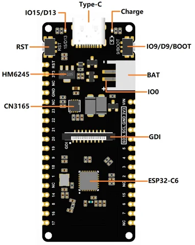
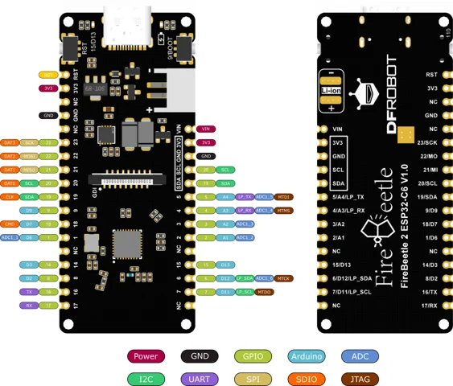

# FireBeetle 2 ESP32-C6 IoT Development Board / DFR1075

**DFRobot** · ESP32-C6

Revision: Not identified

Coverage: Physical pinout reference; independent completeness review pending

[Browse all manufacturers](../../../../BROWSE.md) · [Devices & IoT](../../../../DEVICES.md) · [Open in the browser guide](https://valleytech-black-wire-guide.pages.dev/?board=dfrobot-dfr1075)

Architecture: **RISC-V**

## Datasheets and original documentation

Board datasheet: **not yet recorded**. Visual reference: **available**.

[Original manufacturer product documentation](https://wiki.dfrobot.com/dfr1075/)

- **hardware-guide / board**: [Model specifications and hardware reference](https://wiki.dfrobot.com/dfr1075/) · online
- **component-datasheet / component**: [Component datasheet (not a board datasheet)](https://dfimg.dfrobot.com/5d57611a3416442fa39bffca/wiki/6f630301d84caf0e92266e3c5cf11edc.PDF) · online
- **component-datasheet / component**: [Component datasheet (not a board datasheet)](https://dfimg.dfrobot.com/5d57611a3416442fa39bffca/wiki/c5ead36917605c173e2f752de32246a1.PDF) · online
- **component-datasheet / component**: [Component datasheet (not a board datasheet)](https://dfimg.dfrobot.com/5d57611a3416442fa39bffca/wiki/85759bb076bf6bb24fd8ca5683f19603.pdf) · online
- **component-datasheet / component**: [Component datasheet (not a board datasheet)](https://dfimg.dfrobot.com/5d57611a3416442fa39bffca/wiki/5eeffd974782b6cc442f7a2ee7f00577.pdf) · online

Original source reviewed for model and visual type. Pin assignments and electrical limits have not been independently verified. Match the PCB revision before wiring.

[Documentation coverage and remaining gaps](../../../../DOCUMENTATION.md)

## Specifications and hardware documentation

- [Original model specifications](https://wiki.dfrobot.com/dfr1075/)

## FireBeetle 2 ESP32-C6 IoT Development Board — Board Overview

**board labeling image** · Reviewed source · WEBP

[Open original reference](../../../../library/media/2fc93a5192269cb8fcf602b9d21830b42dd8df27543a698c79d9debdbc0dce5e.webp)

**Credit and rights:** DFRobot / original artwork contributors. Asset-specific redistribution and print rights are not established. Black Wire's editorial license does not relicense this artwork.. Source/manufacturer: DFRobot.

[Source 1](https://dfimg.dfrobot.com/5d57611a3416442fa39bffca/wiki/f24d6c2eaa74dacadb153d6f43c12432_0x0.png.webp) · [Source 2](https://wiki.dfrobot.com/dfr1075/)

Original source reviewed for model and visual type. Pin assignments and electrical limits have not been independently verified. Match the PCB revision before wiring.

Image revision: Not identified

SHA-256: `2fc93a5192269cb8fcf602b9d21830b42dd8df27543a698c79d9debdbc0dce5e`

## FireBeetle 2 ESP32-C6 IoT Development Board — Pinout

**pinout image** · Reviewed source · WEBP

[Open original reference](../../../../library/media/c6f0ab8fa148dbb77190e867bf4f040565a455d767db09730e421320e53dd2de.webp)

**Credit and rights:** DFRobot / original artwork contributors. Asset-specific redistribution and print rights are not established. Black Wire's editorial license does not relicense this artwork.. Source/manufacturer: DFRobot.

[Source 1](https://dfimg.dfrobot.com/5d57611a3416442fa39bffca/wiki/1fa8b29bf6d340347ccdc39f4648b949_0x0.png.webp) · [Source 2](https://wiki.dfrobot.com/dfr1075/)

Original source reviewed for model and visual type. Pin assignments and electrical limits have not been independently verified. Match the PCB revision before wiring.

Image revision: Not identified

SHA-256: `c6f0ab8fa148dbb77190e867bf4f040565a455d767db09730e421320e53dd2de`

Pin assignments have not been independently electrically verified. Check board revision before wiring.
