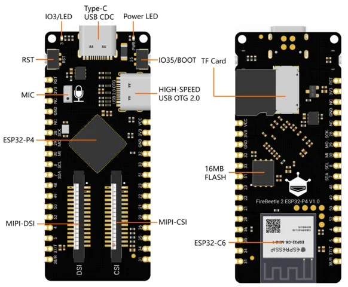

# FireBeetle 2 ESP32-P4 AI Vision Board / DFR1172

**DFRobot** · ESP32-P4 / ESP32-C6

Revision: Not identified

Coverage: Supporting documentation; physical pinout still needed

[Browse all manufacturers](../../../../BROWSE.md) · [Devices & IoT](../../../../DEVICES.md) · [Open in the browser guide](https://valleytech-black-wire-guide.pages.dev/?board=dfrobot-dfr1172)

Architecture: **RISC-V**

## Datasheets and original documentation

Board datasheet: **not yet recorded**. Visual reference: **available**.

[Original manufacturer product documentation](https://wiki.dfrobot.com/dfr1172/)

- **hardware-guide / board**: [Model specifications and hardware reference](https://wiki.dfrobot.com/dfr1172/) · online
- **schematic / board**: [Schematics](https://dfimg.dfrobot.com/wiki/21103/DFR1172_firebeetle-esp32-p4r32-development-board_schematics_V1.0.pdf) · [saved document](../../../../library/media/c1e204cec18000a60c67df70a40fd08f81ae328e24ba909784ac55e5584eb9fe.pdf)
- **component-datasheet / component**: [Component datasheet (not a board datasheet)](https://dfimg.dfrobot.com/wiki/21103/DFR1172_firebeetle-esp32-p4r32-development-board_datasheet_V1.0.pdf) · online

Original source reviewed for model and visual type. Pin assignments and electrical limits have not been independently verified. Match the PCB revision before wiring.

[Documentation coverage and remaining gaps](../../../../DOCUMENTATION.md)

## Specifications and hardware documentation

- [Original model specifications](https://wiki.dfrobot.com/dfr1172/)

## FireBeetle 2 ESP32-P4 AI Vision Board — On-board Function Diagram

**board labeling image** · Reviewed source · WEBP

[Open original reference](../../../../library/media/670409663588e7fe9409324f70dba086195922b9c51d728d639274dbfc633ac1.webp)

**Credit and rights:** DFRobot / original artwork contributors. Asset-specific redistribution and print rights are not established. Black Wire's editorial license does not relicense this artwork.. Source/manufacturer: DFRobot.

[Source 1](https://dfimg.dfrobot.com/5d57611a3416442fa39bffca/wiki/9268fb05b6e55eff2f19c1124910e72a_0x0.png.webp) · [Source 2](https://wiki.dfrobot.com/dfr1172/)

Original source reviewed for model and visual type. Pin assignments and electrical limits have not been independently verified. Match the PCB revision before wiring.

Image revision: Not identified

SHA-256: `670409663588e7fe9409324f70dba086195922b9c51d728d639274dbfc633ac1`

## Schematics

**original reference PDF** · Reviewed source · PDF

[Open original reference](../../../../library/media/c1e204cec18000a60c67df70a40fd08f81ae328e24ba909784ac55e5584eb9fe.pdf)

**Credit and rights:** DFRobot / original artwork contributors. Asset-specific redistribution and print rights are not established. Black Wire's editorial license does not relicense this artwork.. Source/manufacturer: DFRobot.

[Source 1](https://dfimg.dfrobot.com/wiki/21103/DFR1172_firebeetle-esp32-p4r32-development-board_schematics_V1.0.pdf) · [Source 2](https://wiki.dfrobot.com/dfr1172/)

Original source reviewed for model and visual type. Pin assignments and electrical limits have not been independently verified. Match the PCB revision before wiring.

Image revision: Not identified

SHA-256: `c1e204cec18000a60c67df70a40fd08f81ae328e24ba909784ac55e5584eb9fe`

Pin assignments have not been independently electrically verified. Check board revision before wiring.
