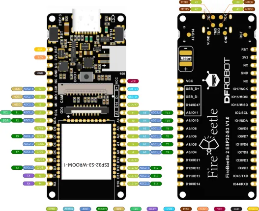

# FireBeetle 2 ESP32-S3

**DFRobot** · ESP32-S3

Revision: Not identified  
Coverage: Pinout image collected

[Browse all manufacturers](../../../../BROWSE.md) · [Desktop app](https://github.com/valleytechsolutions/black-wire-desktop)

## Physical board pinout

**pinout image** · Reviewed source · WEBP

[Open original reference](../../../../library/media/0f397beda2462a37489179fe9ea4fbc0063419637b66e19d563a5812ace04bfc.webp)

**Credit and rights:** Not established; source attribution retained. Source/manufacturer: DFRobot.

[Source 1](https://dfimg.dfrobot.com/nobody/wiki/0aa4e609926355484ad0cab49548d2f3_0x0.jpg.webp) · [Source 2](https://wiki.dfrobot.com/SKU_DFR0975_FireBeetle_2_Board_ESP32_S3)

Discovered from CircuitPython board metadata and the linked product/documentation page. Exact hardware revision requires matching to the diagram.

SHA-256: `0f397beda2462a37489179fe9ea4fbc0063419637b66e19d563a5812ace04bfc`

Pin assignments have not been independently electrically verified. Check board revision before wiring.
