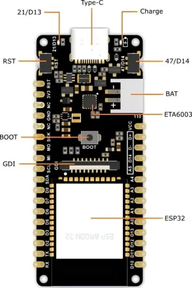

# FireBeetle 2 ESP32-S3 AIoT Development Board / DFR1145

**DFRobot** · ESP32-S3

Revision: Not identified

Coverage: Physical pinout reference; independent completeness review pending

[Browse all manufacturers](../../../../BROWSE.md) · [Devices & IoT](../../../../DEVICES.md) · [Open in the browser guide](https://valleytech-black-wire-guide.pages.dev/?board=dfrobot-dfr1145)

Architecture: **Xtensa**

## Datasheets and original documentation

Board datasheet: **not yet recorded**. Visual reference: **available**.

[Original manufacturer product documentation](https://wiki.dfrobot.com/dfr1145/)

- **hardware-guide / board**: [Model specifications and hardware reference](https://wiki.dfrobot.com/dfr1145/) · online

Original source reviewed for model and visual type. Pin assignments and electrical limits have not been independently verified. Match the PCB revision before wiring.

[Documentation coverage and remaining gaps](../../../../DOCUMENTATION.md)

## Specifications and hardware documentation

- [Original model specifications](https://wiki.dfrobot.com/dfr1145/)

## FireBeetle 2 ESP32-S3 AIoT Development Board — Board Overview V1.0

**board labeling image** · Reviewed source · WEBP

[Open original reference](../../../../library/media/7a424676e5c4bce6a52846956530b1ce4787233ef96475ec2b37b4703ea4f110.webp)

**Credit and rights:** DFRobot / original artwork contributors. Asset-specific redistribution and print rights are not established. Black Wire's editorial license does not relicense this artwork.. Source/manufacturer: DFRobot.

[Source 1](https://dfimg.dfrobot.com/8116b3fb111c496b92a0efac795320fc/wikien/4b105a317bb888385f1f364e7376031c_0x0.png.webp) · [Source 2](https://wiki.dfrobot.com/dfr1145/)

Original source reviewed for model and visual type. Pin assignments and electrical limits have not been independently verified. Match the PCB revision before wiring.

Image revision: Not identified

SHA-256: `7a424676e5c4bce6a52846956530b1ce4787233ef96475ec2b37b4703ea4f110`

## FireBeetle 2 ESP32-S3 AIoT Development Board — Board Overview V1.1

**board labeling image** · Reviewed source · WEBP

[Open original reference](../../../../library/media/8810e23a0fca6dcd046d878790c3d1b03541b101b64fae74a9a24bcbeec40b93.webp)

**Credit and rights:** DFRobot / original artwork contributors. Asset-specific redistribution and print rights are not established. Black Wire's editorial license does not relicense this artwork.. Source/manufacturer: DFRobot.

[Source 1](https://dfimg.dfrobot.com/8116b3fb111c496b92a0efac795320fc/wikien/f838ea5e8000d0bf8a0745451b538e24_0x0.jpg.webp) · [Source 2](https://wiki.dfrobot.com/dfr1145/)

Original source reviewed for model and visual type. Pin assignments and electrical limits have not been independently verified. Match the PCB revision before wiring.

Image revision: Not identified

SHA-256: `8810e23a0fca6dcd046d878790c3d1b03541b101b64fae74a9a24bcbeec40b93`

## FireBeetle 2 ESP32-S3 AIoT Development Board — Pinout

**pinout image** · Reviewed source · WEBP

[Open original reference](../../../../library/media/0f397beda2462a37489179fe9ea4fbc0063419637b66e19d563a5812ace04bfc.webp)

**Credit and rights:** DFRobot / original artwork contributors. Asset-specific redistribution and print rights are not established. Black Wire's editorial license does not relicense this artwork.. Source/manufacturer: DFRobot.

[Source 1](https://dfimg.dfrobot.com/nobody/wiki/0aa4e609926355484ad0cab49548d2f3_0x0.jpg.webp) · [Source 2](https://wiki.dfrobot.com/dfr1145/)

Original source reviewed for model and visual type. Pin assignments and electrical limits have not been independently verified. Match the PCB revision before wiring.

Image revision: Not identified

SHA-256: `0f397beda2462a37489179fe9ea4fbc0063419637b66e19d563a5812ace04bfc`

Pin assignments have not been independently electrically verified. Check board revision before wiring.
